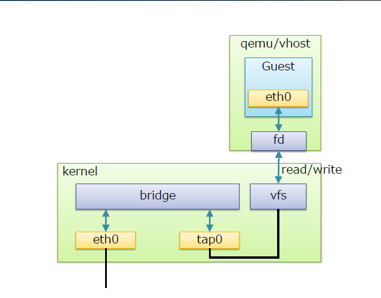
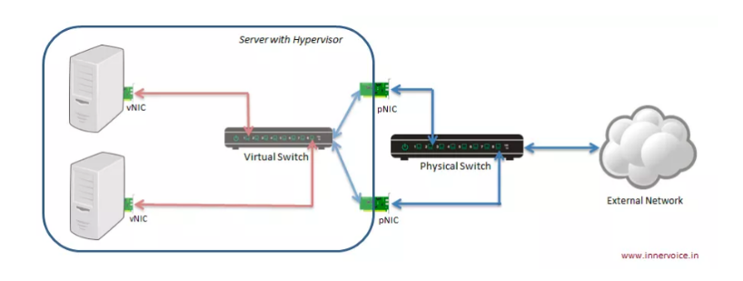

# Linux Bridge

## Khái niệm

* Linux bridge là một phần mềm đươc tích hợp vào trong nhân Linux để giải quyết vấn đề ảo hóa phần network trong các máy vật lý.

* Về mặt logic Linux bridge sẽ tạo ra một con switch ảo để cho các VM kết nối được vào và có thể nói chuyện được với nhau cũng như sử dụng để ra mạng ngoài.

* Mô hình

    

* Các thành phần trong mô hình trên

    - Port: tương đương với port của switch thật
    - Bridge: tương đương với switch layer 2
    - Tap: hay tap interface có thể hiểu là giao diện mạng để các VM kết nối với bridge cho linux bridge tạo ra
    - fd: forward data - chuyển tiếp dữ liệu từ máy ảo tới bridge

* Các tính năng
    - STP: Spanning Tree Protocol - giao thức chống loop gói tin trong mạng
    - VLAN: chia switch (do linux bridge tạo ra) thành các mạng LAN ảo, cô lập traffic giữa các VM trên các VLAN khác nhau của cùng một switch.
    - FDB: chuyển tiếp các gói tin theo database để nâng cao hiệu năng switch

* Mô hình trên server: 

     

     - Ta thấy rằng có một switch được tạo ra nằm bên trong của máy vật lý. Các VM kết nối đến đây để có thể liên lạc được với nhau. Nếu muốn liên lạc ra bên ngoài ta có thể kết nối con switch này với card mạng trên máy vật lý của ta (giống như ta dùng dây kết nối switch với router). Ta có thể kết nối switch với 1 hoặc nhiều port.

     - Các port kết nối:
        
        -  Virtual Computing Device: Thường được biết đến như là máy ảo VM chạy trong host server.
        - Virtual NIC (vNIC): máy ảo VM có virtual network adapters(vNIC) mà đóng vai trò là NIC cho máy ảo.
        - Physical swtich port: Là port sử dụng cho Ethernet switch, cổng vật lý xác định bởi các port RJ45. Một port RJ45 kết nối tới port trên NIC của máy host.
        - Virtual swtich port: là port ảo tồn tại trên virtual switch. Cả virtual NIC (vNIC) và virtual port đều là phần mềm, nó liên kết với virtual cable kết nối vNIC.

* Câu lệnh quản lý Linux Bridge

    - Câu lệnh cài đặt Linux Bridge :

    `sudo apt-get install bridge-ultils -y`

    - Tạo Linux Bridge:  `brctl addbr <bridge>` 
    - Xóa Linux Bridge:  `brctl delbr <bridge>`
    - Tạo interface(port) trên bridge: `brctl addif <bridge> <ifname>`
    - Xóa interface trên bridge: `brctl delbr <bridge>`
 
    - Khởi động lại các NIC và vNIC `ifdown -a && ifup -a`

* Câu lệnh quản lý tính năng FDB: 

    - Shows a list of MACs in FDB: `brctl showmacs <bridge>	` hoặc  `bridge fdb show` 
    - Sets FDB garbage collector interval: `brctl setgcint <brname> <time>`
    - Adds FDB entry: `bridge fdb add dev <interface> [dst, vni, port, via]`
    - Appends FDB entry: `bridge fdb append dev <interface> `
    - Deletes FDB entry: `bridge fdb delete dev <interface>`

* Câu lệnh quản lý STP:

    - Turning STP on/off : `brctl stp <bridge> <state>`
    
    - Setting bridge priority: `brctl setbridgeprio <bridge> <priority>`
    - Thiết lập Port priority: `bridge link set dev <port> priority <priority>`
    - Thiết lập cost của port trên bridge: `bridge link set dev <port> cost <cost>`
    - Thiết lập state của port: `bridge link set dev <port> state <state>`

        -  0 - port is DISABLED. Trạng thái down

        - 1 - STP LISTENING state. Chỉ gửi và nhận BPDU , không học MAC.

        -  2 - STP LEARNING state. Nhận và gửi BPDU, học MAC
        -  3 - STP FORWARDING state. Port is fully active.

        - 4 - STP BLOCKING state. Nhận BPDU, Không gửi BPDU, không học MAC, 

* Quản lý VLAN: 
    - Creating new VLAN filter entry (Tạo VLAN): `bridge vlan add dev [vid, pvid, untagged, self, master]`
    
    - Delete VLAN filter entry (Xóa VLAN):	`bridge vlan del dev [vid, pvid, untagged, self, master]`
    
    - Show VLAN: `bridge vlan show`

