# 1. Tìm hiểu về Namespace trong Linux

## 1.1 Network namespace là gì 

*Network namespace được sử dụng trong khá nhiều dự án như Openstack, Docker và Mininet. Để hiểu sâu về các dự án này, bạn sẽ phải hiểu namespaces và các sử dụng chúng*

* Network namespaces cho phép bạn cô lập môi trường network trên một máy chủ.
* Namespace phân chia việc sử dụng các khái niệm liên quan đến network như devices, địa chỉ address, port, định tuyến và các quy tắc tường lửa vào trong một box, chủ yếu là ảo hóa mạng trong một máy chạy một kernel duy nhất.
* Mỗi namespace có riêng interface, bảng định tuyến, các thiết lập iptables và tách riêng phân biệt với các namespace khác. Ngoài ra, các tiến trình trong hệ thống có thể chạy riêng biệt trong mỗi namespace.

## 1.2 Làm việc với network namespaces

* Khi khởi động Linux, mặc định sẽ có một namespace trong hệ thống. và tiến trình được tạo sẽ kế thừa namespace này (rootnamespace). Tức là tất cả các tiến trình thừa kế network namespace sẽ được init sử dụng (PID 1).

    

### 1.2.1 List namespaces

* Cách làm việc với namespace là sử dụng câu lệnh: `ip netns`

*Để liệu kê tất cả các network namespaces trong hệ thống*

`ip netns` hoặc `ip netns`

### 1.2.2 Add namespaces

* Để add một namespace, dùng câu lệnh:

    `ip netns add <name>`

    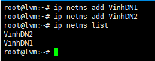

    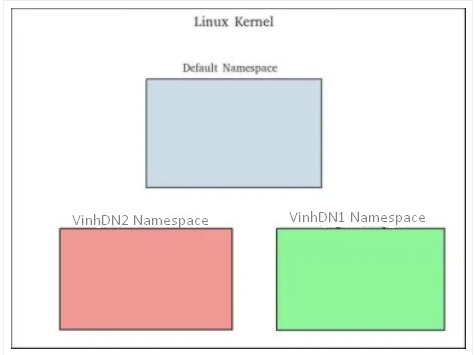

* Mỗi khi thêm vào một namespace, một file mới được tạo trong thư mục /var/run/netns với tên giống như tên namespace. (không bao gồm file của root namespace).

    `ls -l /var/run/netns`

    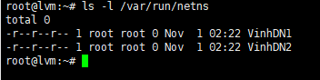

### 1.2.3 Executing commands trong namespaces

* Để xử lý các lệnh trong một namespace (không phải root namespace) sử dụng câu lệnh:
    
    `ip netns exec <namespace> <command>`

    

* Ví dụ: chạy lệnh ip a liệt kê địa chỉ các interface trong namespace VinhDN1, VDN2.

    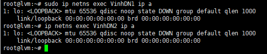

* Kết quả đầu ra sẽ khác so với khi chạy câu lệnh ip a ở chế độ mặc định (trong root namespace). Mỗi namespace sẽ có một môi trường mạng cô lập và có các interface và bảng định tuyến riêng.

* Để liệt kê tất các các địa chỉ interface của các namespace sử dụng tùy chọn –a hoặc –all

    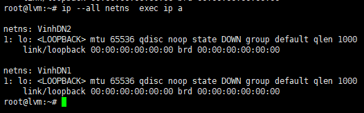 
* Xóa namespace

     `ip netns delete <namespace_name>`

### 1.2.4 Gán interface vào một network namespace

* Sử dụng câu lệnh sau để gán interface vào namespace:

    `ip link set <interface_name> netns <namespace_name>`

    `ip netns delete <namespace_name>`

### 1.2.5 Ping between two namespaces

## 2.VETH

* VETH là Thiết bị ảo hóa Ethernet. Nó đóng vai trò tunnels giữa các network namespace để tạo cầu nối tới thiết bị mạng ở namespace khác, nhưng cũng có thể sử dụng như thiết bị mạng độc lập.

*Bạn có thể tưởng tượng cặp này là một tunnel. Tất cả mọi thứ bạn sẽ gửi qua một đầu của tunnel, sẽ xuất hiện ở đầu kia*

## 

## 3. LAB

### 3.1 Kết nối 2 namespace sử dụng openvswitch
* Mô hình:

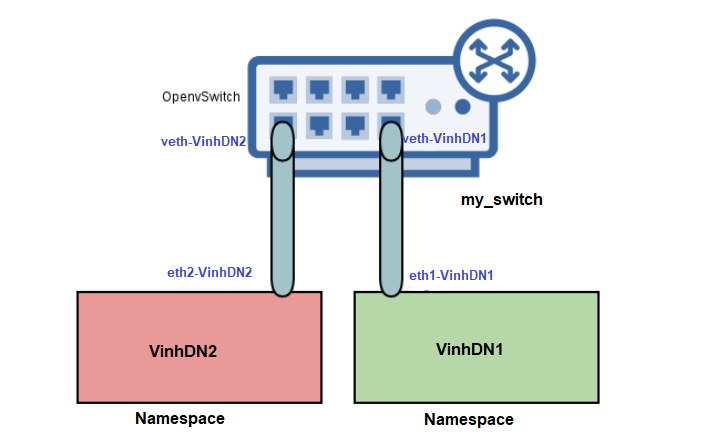

 * Tạo OpenvSwitch
 
 `ovs-vsctl add-br my_switch`

check:  `ovs-vsctl show`
  
* sử dụng 1 cặp veth pair để kết nối

`ip link add veth1 type veth peer name veth2`

*Khi đó, một veth được tạo ra với 2 đầu là 2 interface veth1 và veth2.*

* Như mô hình, thêm veth nối giữa namespace VinhDn1 với switch ảo my_switch và namespace VinhDN2 với switch ảo:

`ip link add veth-VinhDN1 type veth peer name eth1-VinhDN1`

*và*

`ip link add veth-VinhDN2 type veth peer name eth2-VinhDN2`

check: `ip link` Kết nối thông 2 đầu

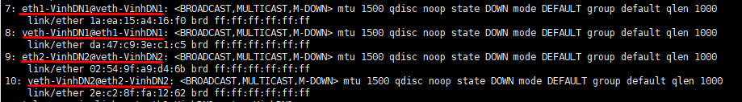

* Gán các interface vào namespace ( bật interface)

    - namespace VinhDN1:

    `ip link set eth1-VinhDN1 netns VinhDN1`
    
    *bật interface*

    ` ip netns exec VinhDN1 ip link set eth1-VinhDN1 up`

    - namespace VinhDN2:

    `ip link set eth2-VinhDN2 netns VinhDN2`
    
    *bật interface*

    ` ip netns exec VinhDN2 ip link set eth2-VinhDN2 up`

* Gán interface vào Switch ảo 

*mở port*

` ip link set veth-VinhDN1 up`
 
 `ip link set veth-VinhDN2 up`

*gán cổng vào switch*

 `ovs-vsctl add-port my_switch veth-VinhDN1`

 `ovs-vsctl add-port my_switch veth-VinhDN2`

 *kiểm tra switch ảo*

 `ovs-vsctl show` : 2 port đã được add

 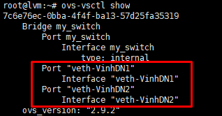

* Gán địa chỉ ip cho port phía namespace
 
*Dùng câu lệnh để gán ip cho interface:*

 `ip netns exec <namespace> ifconfig <interface> <IP/mask>`

*Thực hiện:*

Namespace 1:

`ip netns exec VinhDN1  ifconfig eth1-VinhDN1 10.0.0.1/24`

Namespace 2:

`ip netns exec VinhDN2  ifconfig eth2-VinhDN2 10.0.0.2/24`

*Kiểm tra dùng lệnh:* 

`ip netns exec <namespace> ip a`

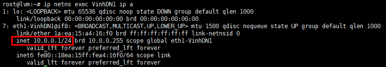

* Ping 2 namespace

Lệnh: `ip netns exec <namespace> ping -c<n> <IP>`

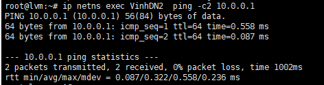

### 3.2  Kết nối trực tiếp thông qua port trên vswitch

*Khi dùng cách này bạn sẽ không cần tạo các cặp veth mà sẽ kết nối trực tiếp với port trên Openvswitch.*

* Thực hiện tạo port ở phía openvswitch:

`ovs-vsctl add-port my_switch vport1 -- set interface vport1 type=internal`

*Và*

 `ovs-vsctl add-port my_switch vport2 -- set interface vport2 type=internal`

*kiểm tra*

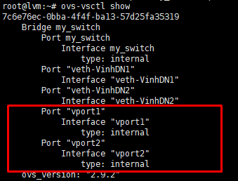

* Gán 2 port trên vào namespace tương ứng

*gán port vào namespace*

 `ip link set vport1 netns VinhDN1`

 `ip link set vport2 netns VinhDN2`
  
*mở các interface*

 `ip netns exec VinhDN1 ip link set vport1 up`

 `ip netns exec VinhDN2 ip link set vport2 up`

 * Kiểm tra ping

    - Thực hiện gán địa chỉ ip cho vport1 :172.0.0.1/24 , vport2: 172.0.0.2/24

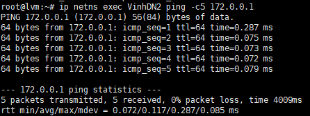

### 3.3 Cấu hình DHCP namespace cấp ip cho network namespace
**Mô hình**

 **Cấu hình**

* Phía 2 namespace: 
    
    - Tạo cặp veth 

    `ip link add veth-VinhDN1 type veth peer name eth1-VinhDN1` 

    `ip link add veth-VinhDN2 type veth peer name eth2-VinhDN2`

    - Gán interface vào namespace

    `ip link set eth0-ns1 netns ns1`
    
    `ip link set eth0-ns2 netns ns2`

    - enable các inteface

    `ip netns exec VinhDN1 ip link set lo up`
    
    `ip netns exec VinhDN1 ip link set eth1-VinhDN1 up`
    
    `ip netns exec VinhDN2 ip link set lo up`
    
    `ip netns exec VinhDN2 ip link set eth2-VinhDN2 up`

    - Gán interface và thêm thông tin vào ovs

    
    `ovs-vsctl add-port my_switch veth-VinhDN1 -- set port veth-VinhDN1 tag=10`

    `ovs-vsctl add-port my_switch veth-VinhDN2 -- set port veth-VinhDN2 tag=20`

    - check: 

    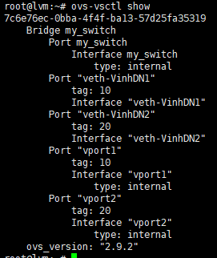
    
* Phía namespace DHCP 
    
    - Tạo namespace :

    `ip netns add DHCP1`

    `ip netns add DHCP2`

    - Gán interface vào namespace DHCP
     
     `ip link set tap1 netns DHCP1`
    
    `ip link set tap2 netns DHCP2`
    
    - Tạo và Gán giá trị các interface vào OvS
    
    `ovs-vsctl add-port my_switch vport1 -- set interface vport1 type=internal`

    `ovs-vsctl set port vport1 tag=10`

    `ovs-vsctl add-port my_switch vport2 -- set interface vport2 type=internal`

    `ovs-vsctl set port vport2 tag=20`
* Tạo range ip và gán ip cho DHCP:

    - Up các cổng trong namespace DHCP:
     
     `ip netns exec DHCP1 bash`

    `ip link set dev lo up`
    
     `ip link set dev vport1 up`
 
    `ip address add 10.0.10.2/24 dev vport1`
    
    - Cấu hình dải địa chỉ của DHCP cho namespace VinhDN1
 
    `ip netns exec DHCP1 dnsmasq --interface=vport1 \
 --dhcp-range=172.16.10.10,172.16.10.100,255.255.0.0`

 **Tương tự với DHCP 2**

 * Kết quả
    
    - Câu lệnh xin cấp phát địa chỉ ip vào interface 
 `ip netns exec VinhDN1 dhclient eth1-VinhDN1`

    - check: `ip netns exec VinhDN1 ip a`

    

---
http://man7.org/linux/man-pages/man4/veth.4.html

https://www.youtube.com/watch?v=_WgUwUf1d34

https://blog.scottlowe.org/2013/09/04/introducing-linux-network-namespaces/index.html

https://github.com/thaihust/Thuc-tap-thang-03-2016/blob/master/ThaiPH/ThaiPH_linux_network_namespaces.md#complex