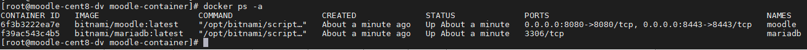
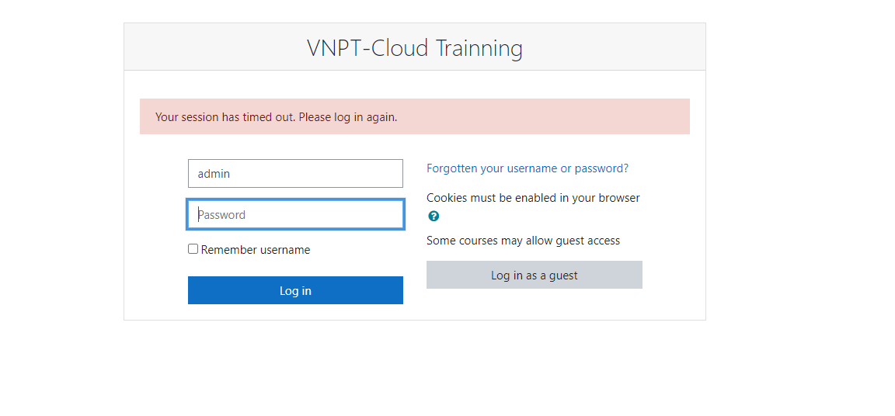

# Cài đặt Moodle

*Hướng dẫn cài đặt Moodle trên Container*

## Cài đặt Docker

### Cài đặt docker-ce

- Bước 1: Cài đặt Repo Epel Update các gói cài đặt
```sh
sudo yum install epel-release

yum -y update
```

- Bước 2: Cài đặt các phần mềm phụ trợ
```sh
sudo yum install -y yum-utils device-mapper-persistent-data lvm2

## Lưu ý phải cài đặt Iptables
yum -y install iptables
```

- Bước 3: Cấu hình add thêm repo docker
```sh
sudo yum-config-manager --add-repo https://download.docker.com/linux/centos/docker-ce.repo
```

- Bước 4: Cài đặt Docker-ce
```sh
sudo yum -y install docker-ce
```

- Bước 5: Start dịch vụ docker
```sh
systemctl enable --now docker
```

Nếu không start được service thì hãy dùng lệnh `sudo dockerd -D` để kiểm tra xem lỗi nào dẫn tới k start được.


## Cài đặt Moodle

- Bước 1: Tạo network để các container kết nối tới nhau
```sh
docker network create moodle-network
```

- Bước 2: Tạo volume cho dữ liệu mariadb và khởi tạo Mariadb container
```sh
docker volume create --name mariadb_data

docker run -d --name mariadb \
  --env ALLOW_EMPTY_PASSWORD=yes \
  --env MARIADB_USER=bn_moodle \
  --env MARIADB_PASSWORD=bitnami \
  --env MARIADB_DATABASE=bitnami_moodle \
  --network moodle-network \
  --volume mariadb_data:/bitnami/mariadb \
  bitnami/mariadb:latest
```

- Bước 3: Tạo thư mục gắn ngoài container và khởi tạo container moodle

    - Khai báo thêm các biến env để custom container như: `MOODLE_USERNAME` và `MOODLE_PASSWORD` để thay đổi tên user và password.

```sh
mkdir -p /var/lib/moodle/moodle-persistence

docker run -d --name moodle \
  -p 8080:8080 -p 8443:8443 \
  --env MOODLE_DATABASE_USER=bn_moodle \
  --env MOODLE_DATABASE_PASSWORD=bitnami \
  --env MOODLE_DATABASE_NAME=bitnami_moodle \
  --env MOODLE_USERNAME=admin \
  --env MOODLE_PASSWORD='VNPT-Cloud123' \
  --env MOODLE_SITE_NAME='VNPT-Cloud Trainning' \
  --network moodle-network \
  --volume /var/lib/moodle/moodle-persistence:/bitnami/moodle \
  bitnami/moodle:latest
```

- Kết quả:




- Truy cập qua: <your_IP>:8080



---

## Tham khảo

[1] https://hub.docker.com/r/bitnami/moodle/