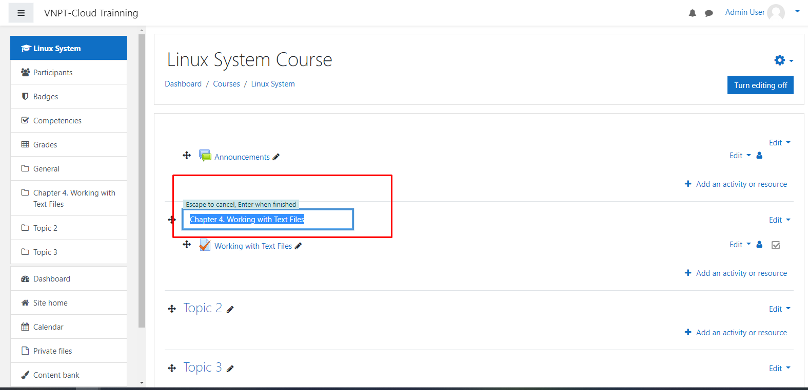
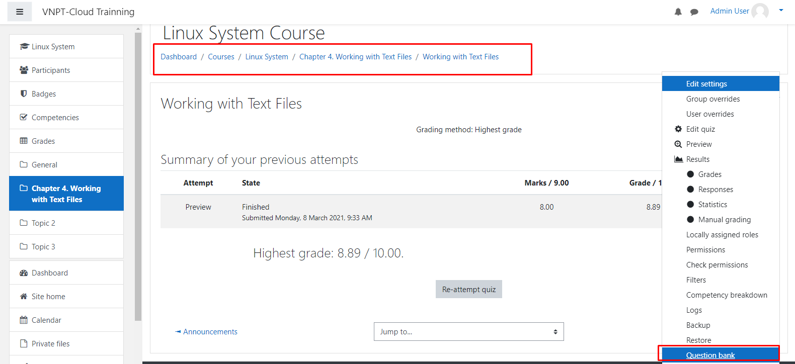
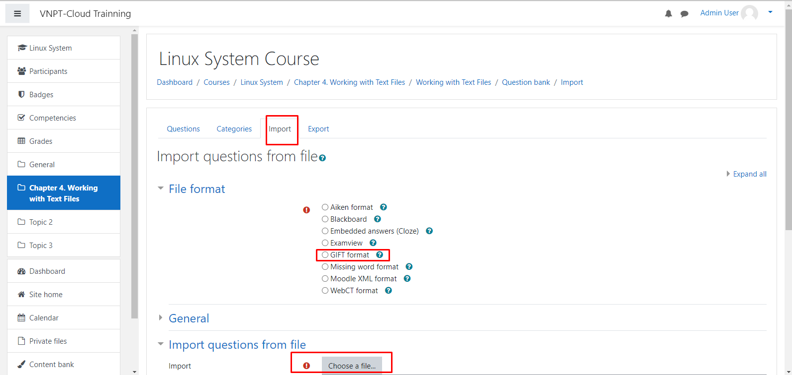
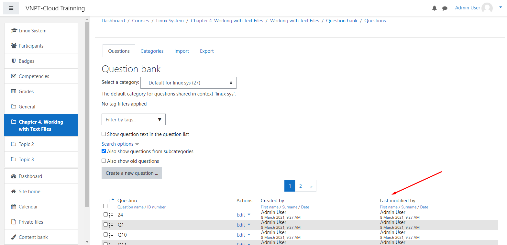
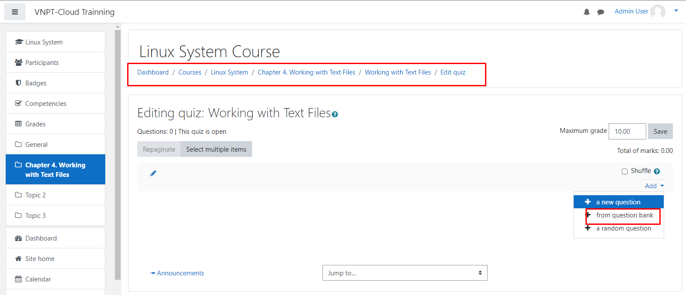

# Cách Import Quiz trên Moodle

*Hướng dẫn viết Câu hỏi định dạng GIFT*

- GIFT là ngôn ngữ đánh dấu giống như wiki để mô tả các bài kiểm tra. chỉnh sửa các câu hỏi có dạng multiple-choice, true-false, short answer, matching missing word. 


## Hướng dẫn viết GIFT format

### 1. Chọn 1 câu trả lời đúng
```
::Q5::Which of the following lines would only show lines in the file /etc/passwd that
start with the text anna?
{
~grep anna /etc/passwd
~grep -v anna /etc/passwd
~grep $anna /etc/passwd
=grep ^anna /etc/passwd
####When used in a regular expression, the ^ sign in front of the text you are looking for indicates that the text has to be at the beginning of the line.
}
```

- `::Q5::` Khai báo câu hỏi
- Câu trả lời và chú giải được đưa vào `{}`
- `~`: Là câu trả lời sai
- `=`: Là câu trả lời đúng

### 2. Câu hỏi multiple choice
```
::Q108::Which of the following statement is correct? Pick exactly two statements.
{
~%50%Image is a collection of immutable layers whereas container is a running instance of an image.
~%-100%Container can exist without the image but image cannot exist without container
~%-100%Only one container can be spawned from a given image at a time
~%50%If multiple containers are spawned from the same image then they all use the same copy of image in memory.
}
```

### 3. Câu hỏi đúng sai
```
The sun rises in the east.{T}
```

### 4. Matching
```
Match the following countries with their corresponding capitals. 
{
    =Canada -> Ottawa
    =Italy  -> Rome
    =Japan  -> Tokyo
    =India  -> New Delhi
}
```

## Cách Import lên Moodle


- Tạo topic



- Tạo Activity là quiz rồi chọn question bank



- Import file Gift câu hỏi đã chuẩn bị sẵn, chọn định dạng r chọn import phía dưới



- Kết quả sau khi import các quiz



- Quay lại Activity đã tạo. Chọn Add Quiz from question bank. 



