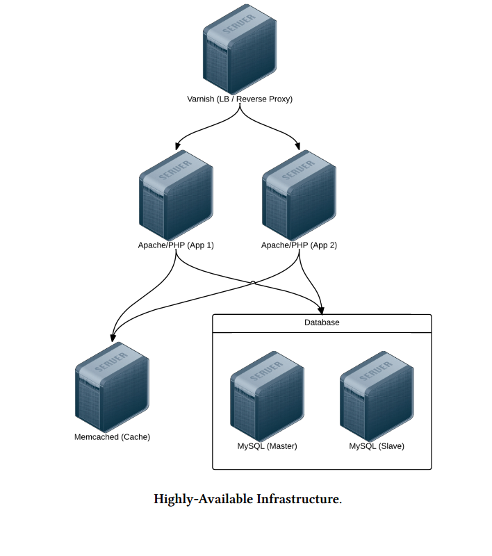

# Chapter 8: Ansible Cookbook

## Highly-Available Infrastructure with Ansible
### Mô hình triển khai


- **Varnish**: Server làm LoadBalancer , reverse proxy 
- **Apache**: Webserver chạy PHP
- **MYSQL**: Mysql server cấu hìn master và slave

### Directory Structure (Cấu trúc thư mục)

- lamp-infrastructure/
- inventories/
- playbooks/
   - db/
   - memcached/
   - varnish/
   - www/

### Server Playbook
#### **Varnish**
- Tạo file main.yml trong thư mục playbooks/varnish 
```
- hosts: lamp-varnish
  sudo: yes
  vars_files:
   - vars.yml

  roles:
   - geerlingguy.firewall
   - geerlingguy.repo-epel
   - geerlingguy.varnish

  tasks:
   - name: Copy Varnish default.vcl.
     template:
       src: "templates/default.vcl.j2"
       dest: "/etc/varnish/default.vcl"
     notify: restart varnish
```

- Tạo thư mục vars.yml cùng thư mục main.yml phía trên
```
firewall_allowed_tcp_ports:
 - "22"
 - "80"

varnish_use_default_vcl: false
```

- Tạo một thư mục templates trong thư mục playbooks/varnish và tạo file default.vcl.j2

```
 vcl 4.0;

 import directors;

 
 backend www{{ loop.index }} {
   .host = "{{ host }}";
   .port = "80";
 }
 

 sub vcl_init {
   new vdir = directors.random();
 
   vdir.add_backend(www{{ loop.index }}, 1);
 
 }

 sub vcl_recv {
   set req.backend_hint = vdir.backend();
   # For testing ONLY; makes sure load balancing is working correctly.
   return (pass);
 }
```

- Tạo file main.yml trong thư mục playbooks/www với nội dung:
```
2 - hosts: lamp-www
3 sudo: yes
4 5
vars_files:
6 - vars.yml
7 8
roles:
9 - geerlingguy.firewall
10 - geerlingguy.repo-epel
11 - geerlingguy.apache
12 - geerlingguy.php
13 - geerlingguy.php-mysql
14 - geerlingguy.php-memcached
15
16 tasks:
17 - name: Remove the Apache test page.
18 file:
19 path: /var/www/html/index.html
20 state: absent
21 - name: Copy our fancy server-specific home page.
22 template:
23 src: templates/index.php.j2
24 dest: /var/www/html/index.php
```
#### **Apache/PHP**

- Tạo file main.yml trong thư mục playbooks/www với nội dung:
  ```
  1   ---
  2   - hosts: lamp-www
  3   sudo: yes
  4 
  5   vars_files:
  6    - vars.yml
  7 
  8   roles:
  9    - geerlingguy.firewall
  10   - geerlingguy.repo-epel
  11   - geerlingguy.apache
  12   - geerlingguy.php
  13   - geerlingguy.php-mysql
  14   - geerlingguy.php-memcached
  15
  16  tasks:
  17   - name: Remove the Apache test page.
  18     file:
  19     path: /var/www/html/index.html
  20     state: absent
  21   - name: Copy our fancy server-specific home page.
  22     template:
  23     src: templates/index.php.j2
  24     dest: /var/www/html/index.php
  ```
  - `geerlingguy.apache`: install và cấu hình phiên bản mới nhất của Apache web

  - `geerlingguy.php` install và cấu hình PHP để chạy thông qua Apache.

  - `geerlingguy.php-mysql`: cấu hình Mysql hỗ trợ PHP

  - `geerlingguy.php-memcached`: Cấu hình memcached hỗ trợ PHP
- Tạo file vars.yml cùng thư mục với file main.yml ở trên với nội dung:
  ```
  firewall_allowed_tcp_ports:
   - "22"
   - "80"
  ```

- Tạo thư mục `templates` trong thư mục `playbooks/www` và trong đó tạo file `index.php.j2`:
  ```
  1  <?php 
  2  /** 
  3   * @file 
  4   * Infrastructure test page. 
  5   * 
  6   * DO NOT use this in production. It is simply a PoC. 
  7   */ 
  8 
  9  $mysql_servers = array( 
  10   
  11     '{{ host }}', 
  12    
  13   ); 
  14   $mysql_results = array(); 
  15   foreach ($mysql_servers as $host) { 
  16      if ($result = mysql_test_connection($host)) { 
  17        $mysql_results[$host] = '<span style="color: green;">PASS</span>'; 
  18        $mysql_results[$host] .= ' (' . $result['status'] . ')'; 
  19      } 
  20     else { 
  21        $mysql_results[$host] = '<span style="color: red;">FAIL</span>'; 
  22      } 
  23   } 
  24 
  25   // Connect to Memcached. 
  26   $memcached_result = '<span style="color: red;">FAIL</span>'; 
  27   if (class_exists('Memcached')) { 
  28     $memcached = new Memcached; 
  29     $memcached->addServer('{{ groups['lamp-memcached'][0] }}', 11211); 
  30 
  31     // Test adding a value to memcached. 
  32      if ($memcached->add('test', 'success', 1)) { 
  33        $result = $memcached->get('test'); 
  34        if ($result == 'success') { 
  35          $memcached_result = '<span style="color: green;">PASS</span>'; 
  36          $memcached->delete('test'); 
  37        } 
  38      } 
  39   } 
  40 
  41   /** 
  42    * Connect to a MySQL server and test the connection. 
  43    * 
  44    * @param string $host 
  45    *    IP Address or hostname of the server. 
  46    * 
  47    * @return array 
  48    *    Array with keys 'success' (bool) and 'status' ('slave' or 'master'). 
  49    *    Empty if connection failure. 
  50    */ 
  51   function mysql_test_connection($host) { 
  52     $username = 'mycompany_user'; 
  53     $password = 'secret'; 
  54     try { 
  55        $db = new PDO( 
  56           'mysql:host=' . $host . ';dbname=mycompany_database', 
  57          $username, 
  58          $password, 
  59          array(PDO::ATTR_ERRMODE => PDO::ERRMODE_EXCEPTION)); 
  60 
  61        // Query to see if the server is configured as a master or slave. 
  62        $statement = $db->prepare("SELECT variable_value 
  63          FROM information_schema.global_variables 
  64          WHERE variable_name = 'LOG_BIN';"); 
  65        $statement->execute(); 
  66        $result = $statement->fetch(); 
  67 
  68        return array( 
  69           'success' => TRUE, 
  70           'status' => ($result[0] == 'ON') ? 'master' : 'slave', 
  71        ); 
  72      } 
  73     catch (PDOException $e) { 
  74        return array(); 
  75      } 
  76   } 
  77   ?> 
  78   <!DOCTYPE html> 
  79   <html> 
  80   <head> 
  81      <title>Host {{ inventory_hostname }}</title> 
  82      <style>* { font-family: Helvetica, Arial, sans-serif }</style> 
  83   </head> 
  84   <body> 
  85      <h1>Host {{ inventory_hostname }}</h1> 
  86      <?php foreach ($mysql_results as $host => $result): ?> 
  87        <p>MySQL Connection (<?php print $host; ?>): <?php print $result; ?></p> 
  88      <?php endforeach; ?> 
  89      <p>Memcached Connection: <?php print $memcached_result; ?></p> 
  90   </body> 
  91   </html> 
  ```
  - (9-23) Nhắc lại tất cả các host mysql được nêu trong file inventory và test khả năng kết nối tới các host đó.
  - (25-39) Kiểm tra kết nối với host memcached
  - (41-76) Kiểm tra khả năng kiết nối tới Mysql server 
  - (78-91) In ra kết quả kết nối tới host Mysql và Memcached cùng với biến {{inventory_-hostname}} là tiêu đề.

#### **Memcached**
- Tạo file `playbooks/memcached/main.yml`  với nội dung:

  ```
   1   --- 
   2   - hosts: lamp-memcached 
   3     sudo: yes 
   4 
   5     vars_files: 
   6        - vars.yml 
   7 
   8     roles: 
   9        - geerlingguy.firewall 
  10        - geerlingguy.memcached 
  ```
  - Để chắc chắn port TCP ở các server mở ,ta thao tác ở role `geerlingguy.firewall`. Sau đó ở role `geerlingguy.memcached` sẽ cài đặt Memcached.

- Trong file vars.yml:
  ```
  1   --- 
  2   firewall_allowed_tcp_ports: 
  3     - "22" 
  4   firewall_additional_rules: 
  5     - "iptables -A INPUT -p tcp --dport 11211 -s {{ groups['lamp-www'][0] }} -j AC\ 
  6  CEPT" 
  7     - "iptables -A INPUT -p tcp --dport 11211 -s {{ groups['lamp-www'][1] }} -j AC\ 
  8  CEPT" 
  ```

#### **MySQL**
- Tạo file `playbooks/db/main.ym` với nội dung: 
  ```
    1   --- 
    2   - hosts: lamp-db 
    3     sudo: yes 
    4 
    5     vars_files: 
    6        - vars.yml 
    7 
    8     pre_tasks: 
    9        - name: Create dynamic MySQL variables. 
   10          set_fact: 
   11             mysql_users: 
   12               - { 
   13                  name: mycompany_user,
   14                  host: "{{ groups['lamp-www'][0] }}", 
   15                  password: secret, 
   16                  priv: "*.*:SELECT" 
   17               } 
   18               - { 
   19                  name: mycompany_user, 
   20                  host: "{{ groups['lamp-www'][1] }}", 
   21                  password: secret, 
   22                  priv: "*.*:SELECT" 
   23               } 
   24            mysql_replication_master: "{{ groups['a4d.lamp.db.1'][0] }}" 
   25 
   26     roles: 
   27        - geerlingguy.firewall 
   28        - geerlingguy.mysql  
   ```
   - Ta sử dụng option `set_fact` trong `pre_task` (chạy trước role bật firewall và cài đặt cấu hình Mysql) để tự động tạo các biến cấu hình trước cho Mysql.
   - `set_fact` Tạo 2 biến: 
    
      - `mysql_users` là list các user sẽ được tạo khi role `geerlingguy.mysql` chạy. 
      - `mysql_replication_master`: để chỉ ra cho role `geerlingguy.mysql` node nào là node master và sẽ đảm bảo cho các node slave được cấu hình sao chép dữ liệu từ node master.
-  Các biến được gán trong file `playbooks/db/vars.yml` có nội dung:
  ```
  1   --- 
  2   firewall_allowed_tcp_ports: 
  3      - "22" 
  4      - "3306" 
  5 
  6   mysql_replication_user: {name: 'replication', password: 'secret'} 
  7   mysql_databases: 
  8      - { name: mycompany_database, collation: utf8_general_ci, encoding: utf8 } 
  ```

#### **Inventory**
```

  1   [lamp-varnish] 
  2     192.168.2.2 
  3 
  4   [lamp-www] 
  5     192.168.2.3 
  6     192.168.2.4 
  7 
  8   [a4d.lamp.db.1] 
  9     192.168.2.5 
 10 
 11   [lamp-db] 
 12     192.168.2.5 
 13     192.168.2.6 
 14 
 15   [lamp-memcached] 
 16     192.168.2.7 
 ```
 #### **Main playbook for all servers**
 - Tạo file configure.yml:
  ```
  1   --- 
  2   - include: playbooks/varnish/main.yml 
  3   - include: playbooks/www/main.yml 
  4   - include: playbooks/db/main.yml 
  5   - include: playbooks/memcached/main.yml 
  ```

- Tham khảo thêm cách viết tại:
  - https://github.com/geerlingguy/ansible-for-devops/tree/master/lamp-infrastructure

- Cách viết các roles:
  - [geerlingguy.firewall](https://github.com/geerlingguy/ansible-role-firewall)
  - [geerlingguy.repo-epel
](https://github.com/geerlingguy/ansible-role-repo-epel)
  - [geerlingguy.varnish](https://github.com/geerlingguy/ansible-role-varnish)
  - [geerlingguy.apache](https://github.com/geerlingguy/ansible-role-apache)
  - [geerlingguy.php](https://github.com/geerlingguy/ansible-role-php)
  - [geerlingguy.php-mysql](https://github.com/geerlingguy/ansible-role-php-mysql)
  - [geerlingguy.php-memcached](https://github.com/geerlingguy/ansible-role-php-memcached)
  - [geerlingguy.mysql](https://github.com/geerlingguy/ansible-role-mysql)
  - [geerlingguy.memcached](https://github.com/geerlingguy/ansible-role-memcached)