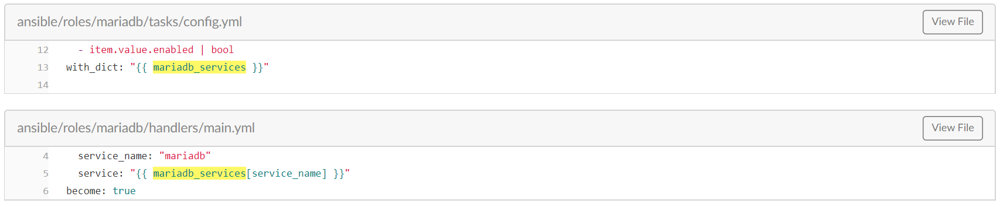

# Role Mariadb
# Cấu trúc: 
- [defaults](#1)
    - [main.yml](#1.1)
- [handlers](#2)
    - [main.yml](#2.1)
- [meta](#3)
    - [main.yml](#3.1)
- [tasks](#4)
	- [main.yml](#4.1)
	- [kolla-action=bootstrap-servers](#4.2)	
		- [bootstrap.yml](#4.2.1)
		- [lookup_cluster.yml](#4.2.2)
		- [bootstrap_cluster.yml](#4.2.3)
		- [recover_cluster.yml](#4.2.4)
		- [wait_for_loadbalancer.yml](#4.2.5)
	- [kolla-action=prechecks](#4.3)
		- [prechecks.yml](#4.3.1)
	- [kolla-action=pull](#4.4)
		- [pull.yml](#4.4.1)
	- [kolla-action=deploy](#4.5)
		- [deploy.yml](#4.5.1)
		- [config.yml](#4.5.2)
		- [register.yml](#4.5.3)
	- [kolla-action=mariadb_backup](#4.6)
		- [backup.yml](#4.6.1)
	- [kolla-action=deploy-containers](#4.7)
		- [deploy-containers.yml](#4.7.1)
		- [check-containers.yml](#4.7.2)
		- [lookup_cluster.yml](#4.7.3)
	- [kolla-action=reconfigure](#4.8)
		- [reconfigure.yml](#4.8.1)
	- [kolla-action=stop](#4.9)
		- [stop.yml](#4.9.1)
	- [kolla-action=upgrade](#4.10)
		- [upgrade.yml](#4.10.1)
	- [loadbalancer.yml](#4.11)
	- [reconfigure.yml](#4.12)
- [templates](#5)

<a name='1'></a>
## **Defaults: Mariadb**

- *Tại file `/roles/mariadb/default/main.yml` là nơi chứa các biến sử dụng cho roles `mariadb`*
- Ở đấy khai báo khá nhiều biến và có các biến được khai báo liên kết với nhau  
<a name='1.1'></a>
### Defaults/main.yml : Mariadb
- Đây là một file chứa biến của 1 role, các biến này được sử dụng rất nhiều lần nên khai báo khá rối, thậm chí trong 1 `tasks` của `mariadb` còn kéo 1 role tên là `haproxy-config` về để chạy các biến ở role `mariadb` này. 
- **Ví dụ** đoạn 1: 
    ```
    mariadb_services:
    mariadb:
        container_name: mariadb
        group: mariadb
        enabled: true
        image: "{{ mariadb_image_full }}"
        volumes: "{{ mariadb_default_volumes + mariadb_extra_volumes }}"
        dimensions: "{{ mariadb_dimensions }}"
    ....

    mariadb_default_volumes:
    - "{{ node_config_directory }}/mariadb/:{{ container_config_directory }}/:ro"
    - "/etc/localtime:/etc/localtime:ro"
    - "mariadb:/var/lib/mysql"
    - "kolla_logs:/var/log/kolla/"
    mariadb_extra_volumes: "{{ default_extra_volumes }}"
    ....

    ```
    
    - Đoạn đầu Ta nhìn thấy như 1 cây thư mục @@ bởi vì các biến này sẽ được gọi bằng cách gọi đến biến `{{ mariadb_services }}` nhưng thêm tham số khai báo service con như đây :

    

    - Phía dưới là các khai báo biến thông thường và lấy từ file `/group_vars/all.yml` như là các biến `{{ default_extra_volumes }}`, `{{ node_config_directory }}`, `{{ container_config_directory }}` 
    - Nếu bạn thắc mắc các dấu "-" kia và khi khai báo biến `volumes: "{{ mariadb_default_volumes + mariadb_extra_volumes }}"` sẽ có kết quả như thế nào.
    ```
    #đây là kết quả tôi đã viết thử playbook ansible và test
    image: 
        - "{{ node_config_directory }}/mariadb/:{{ container_config_directory }}/:ro"
        - "/etc/localtime:/etc/localtime:ro"
        - "mariadb:/var/lib/mysql"
        - "kolla_logs:/var/log/kolla/"
        - "{{ default_extra_volumes }}"
    # Tức là lại khai báo thêm biến con `image` có giá trị phía dưới
	```
- **Ví dụ ** đoạn 2:
    ```
    ...
    mariadb_backup_host: "{{ groups['mariadb'][0] }}"
    ...
    ```
    - Ở đây tức là lấy tên host hoặc địa chỉ ip được khai báo ở group `[mariadb]` trong file `/iventory/all-in-one` hoặc `/inventory/multinode` và thông số `[0]` là lấy thông tin dòng đầu tiên(host ở dòng đầu)
-  **Ví dụ ** đoạn 3:
	```
	internal_haproxy_members: "server {{ hostvars[host]['ansible_hostname'] }} {{ 'api' | kolla_address(host) }}:{{ mariadb_port }} check inter 2000 rise 2 fall 5 backup;"
	external_haproxy_members: "server {{ host }} {{ host }}:{{ mariadb_port }} check inter 2000 rise 2 fall 5 backup;"
	```
	- `inventory_hostname`: Là các cấu hình trong file inventory
	- ``:  Sẽ liệt kê tất cả các host trong group `[mariadb]`
	- `hostvars[host]['ansible_hostname']`:  `hostvars` sẽ được sử dụng khi bạn muốn mang một biến của host khác, giá trị fact của host khác về sử dụng. tên host [
---
<a name='2'></a>
## **Handlers: Mariadb**
- *Đây là nơi thực hiện khai báo các tác vụ chờ được gọi bằng tasks trong các file trong thư mục `/tasks/...yml`*
<a name='2.1'></a>
### Handlers/main.yml : Mariadb
#### Các modules trong file
`1. listen`
- Khái niệm:
    - Đây là module được sử dụng trong mục `handlers` nhằm khai báo các task chờ để sau đó gọi bằng `notify` trong tasks chính.
- Khi Kolla-Ansible sử dụng: 


`2. wait_for`,`delay`,`until`,`retries`

- Khái niệm: 
    - Module này sử dụng để chờ 1 service, host, port được khởi tạo trong một môi trường

- Khi Kolla-Ansible sử dụng: 
  ```
    - name: Wait for first MariaDB service port liveness
  wait_for:
    host: "{{ api_interface_address }}"
    port: "{{ mariadb_port }}"
    connect_timeout: 1
    timeout: 60
    search_regex: "MariaDB"
  register: check_mariadb_port
  until: check_mariadb_port is success
  retries: 10
  delay: 6
  ```
- Chức năng khi sử dụng module này trong kolla-Ansible:

    - Xác định trạng thái của `port` mariadb là mục tiêu chờ
    -  thông số `connect_timeout` : maximum giây đợi tồn tại port mariadb tồn tại hay k trước khi đóng hoặc thử lại
    - thông số `timeout`: số giây tối đa chờ xuất hiện port
    - module `register` ở đây thực hiện gán kết quả của việc kiểm tra port có tồn tại hay không
    - `until: check_mariadb_port is success` cho đến khi port tồn tại thì chạy tiếp còn nếu không thực hiện `retries` 10 lần mỗi lần `delay` 6s rồi failed


<a name='1'></a>
## **Tasks: Mariadb**
- 
