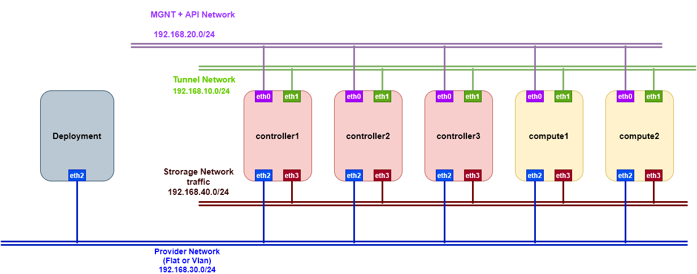

# Triển khai Openstack multinode HA bằng Kolla-ansible

## Mô hình triển khai
- Ở đây tôi sử dụng 4 card mạng cho mỗi node
	- eth0: Làm Management network quản lý giao tiếp API 
	- eth1: Làm đường cấp tunnel network cho VMs
	- eth2: Cung cấp IP public để các VMs sử dụng flat network đi ra internet
	- eth3: traffic dùng cho storage *( hiện tại chưa sử dụng)* 


- IP Plan

## Cấu hình network, hostname

- Node Controller 1
```
cat << EOF > /etc/sysconfig/network-scripts/ifcfg-eth0
TYPE=Ethernet
BOOTPROTO=static
NAME=eth0
DEVICE=eth0
ONBOOT=yes
IPADDR=192.168.20.38
NETMASK=255.255.255.0
GATEWAY=192.168.20.1
DNS1=8.8.8.8
EOF

cat << EOF > /etc/sysconfig/network-scripts/ifcfg-eth1
TYPE=Ethernet
BOOTPROTO=static
NAME=eth1
DEVICE=eth1
ONBOOT=yes
IPADDR=192.168.10.26
NETMASK=255.255.255.0
EOF

cat << EOF > /etc/sysconfig/network-scripts/ifcfg-eth2
TYPE=Ethernet
BOOTPROTO=static
NAME=eth2
DEVICE=eth2
ONBOOT=yes
IPADDR=192.168.30.29
NETMASK=255.255.255.0
EOF

cat << EOF > /etc/sysconfig/network-scripts/ifcfg-eth3
TYPE=Ethernet
BOOTPROTO=static
NAME=eth3
DEVICE=eth3
ONBOOT=yes
IPADDR=192.168.40.32
NETMASK=255.255.255.0
EOF
```
- Node Controller2
```
cat << EOF > /etc/sysconfig/network-scripts/ifcfg-eth0
TYPE=Ethernet
BOOTPROTO=static
NAME=eth0
DEVICE=eth0
ONBOOT=yes
IPADDR=192.168.20.35
NETMASK=255.255.255.0
GATEWAY=192.168.20.1
DNS1=8.8.8.8
EOF

cat << EOF > /etc/sysconfig/network-scripts/ifcfg-eth1
TYPE=Ethernet
BOOTPROTO=static
NAME=eth1
DEVICE=eth1
ONBOOT=yes
IPADDR=192.168.10.27
NETMASK=255.255.255.0
EOF

cat << EOF > /etc/sysconfig/network-scripts/ifcfg-eth2
TYPE=Ethernet
BOOTPROTO=static
NAME=eth2
DEVICE=eth2
ONBOOT=yes
IPADDR=192.168.30.38
NETMASK=255.255.255.0
EOF

cat << EOF > /etc/sysconfig/network-scripts/ifcfg-eth3
TYPE=Ethernet
BOOTPROTO=static
NAME=eth3
DEVICE=eth3
ONBOOT=yes
IPADDR=192.168.40.33
NETMASK=255.255.255.0
EOF
```
- Node Controller3
```
cat << EOF > /etc/sysconfig/network-scripts/ifcfg-eth0
TYPE=Ethernet
BOOTPROTO=static
NAME=eth0
DEVICE=eth0
ONBOOT=yes
IPADDR=192.168.20.33
NETMASK=255.255.255.0
GATEWAY=192.168.20.1
DNS1=8.8.8.8
EOF

cat << EOF > /etc/sysconfig/network-scripts/ifcfg-eth1
TYPE=Ethernet
BOOTPROTO=static
NAME=eth1
DEVICE=eth1
ONBOOT=yes
IPADDR=192.168.10.37
NETMASK=255.255.255.0
EOF

cat << EOF > /etc/sysconfig/network-scripts/ifcfg-eth2
TYPE=Ethernet
BOOTPROTO=static
NAME=eth2
DEVICE=eth2
ONBOOT=yes
IPADDR=192.168.30.28
NETMASK=255.255.255.0
EOF

cat << EOF > /etc/sysconfig/network-scripts/ifcfg-eth3
TYPE=Ethernet
BOOTPROTO=static
NAME=eth3
DEVICE=eth3
ONBOOT=yes
IPADDR=192.168.40.31
NETMASK=255.255.255.0
EOF
```

- Node Compute1
```
cat << EOF > /etc/sysconfig/network-scripts/ifcfg-eth0
TYPE=Ethernet
BOOTPROTO=static
NAME=eth0
DEVICE=eth0
ONBOOT=yes
IPADDR=192.168.20.40
NETMASK=255.255.255.0
GATEWAY=192.168.20.1
DNS1=8.8.8.8
EOF

cat << EOF > /etc/sysconfig/network-scripts/ifcfg-eth1
TYPE=Ethernet
BOOTPROTO=static
NAME=eth1
DEVICE=eth1
ONBOOT=yes
IPADDR=192.168.10.29
NETMASK=255.255.255.0
EOF

cat << EOF > /etc/sysconfig/network-scripts/ifcfg-eth2
TYPE=Ethernet
BOOTPROTO=static
NAME=eth2
DEVICE=eth2
ONBOOT=yes
IPADDR=192.168.30.33
NETMASK=255.255.255.0
EOF

cat << EOF > /etc/sysconfig/network-scripts/ifcfg-eth3
TYPE=Ethernet
BOOTPROTO=static
NAME=eth3
DEVICE=eth3
ONBOOT=yes
IPADDR=192.168.40.36
NETMASK=255.255.255.0
EOF
```

- Node Compute2
```
cat << EOF > /etc/sysconfig/network-scripts/ifcfg-eth0
TYPE=Ethernet
BOOTPROTO=static
NAME=eth0
DEVICE=eth0
ONBOOT=yes
IPADDR=192.168.20.34
NETMASK=255.255.255.0
GATEWAY=192.168.20.1
DNS1=8.8.8.8
EOF

cat << EOF > /etc/sysconfig/network-scripts/ifcfg-eth1
TYPE=Ethernet
BOOTPROTO=static
NAME=eth1
DEVICE=eth1
ONBOOT=yes
IPADDR=192.168.10.36
NETMASK=255.255.255.0
EOF

cat << EOF > /etc/sysconfig/network-scripts/ifcfg-eth2
TYPE=Ethernet
BOOTPROTO=static
NAME=eth2
DEVICE=eth2
ONBOOT=yes
IPADDR=192.168.30.35
NETMASK=255.255.255.0
EOF

cat << EOF > /etc/sysconfig/network-scripts/ifcfg-eth3
TYPE=Ethernet
BOOTPROTO=static
NAME=eth3
DEVICE=eth3
ONBOOT=yes
IPADDR=192.168.40.35
NETMASK=255.255.255.0
EOF
```

## Thực hiện cài đặt các phần mềm hỗ trợ trên các node

### Deployment

1
