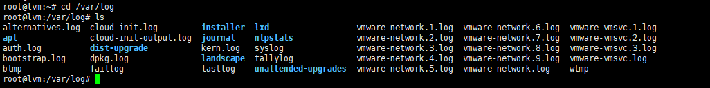
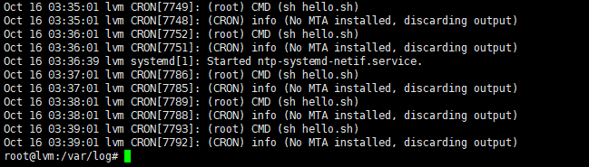
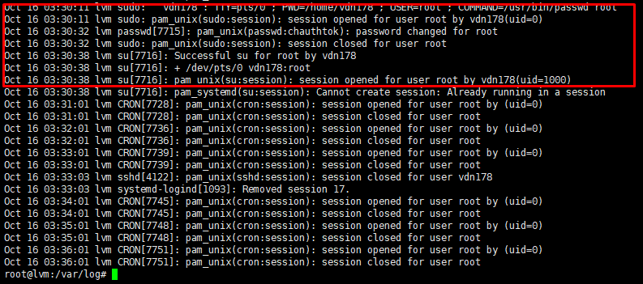
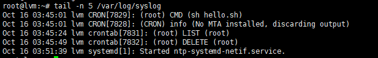
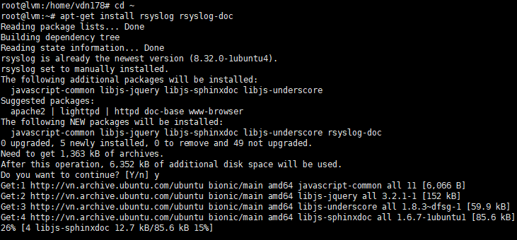
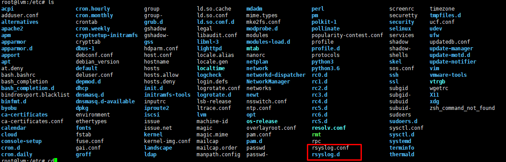
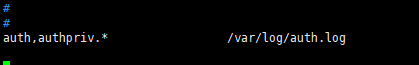
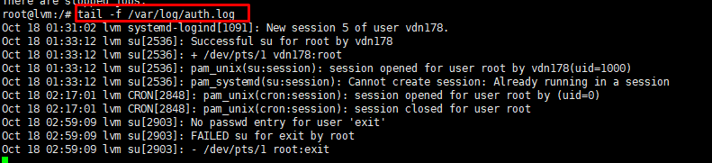
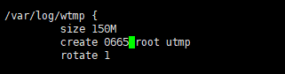

# Log, syslog, rsyslog
# Mục lục
* [1. Log để làm gì?](#1)
* [2. Syslog là gì?](#2)
* [3. Rsyslog là gì?](#3) 
* [4. Mô tả](#4)
* [Tham khảo](#tk)
---

## 1. Log là gì, để làm gì?


*VD*: Khi quản lý một server chưa nhiều dữ liệu quan trọng hoặc đã cài đặt rất nhiều ứng dụng , tính năng. Server hoạt động liên tục 24/24, nhưng tự dưng mất dữ liệu. Muốn điều tra xử lý hay tìm nguyên nhân khắc phục hậu quả xảy ra thì `Log` sẽ giúp việc này.

* 1.1 Log là gì?:

    * `Log` là dữ liệu sinh ra khi hệ thống hoạt động ghi lại liên tục các thông báo về hoạt động của cả hệ thống hoặc của các dịch vụ được triển khai trên hệ thống và file tương ứng.
    
    * Các file log sẽ xuất log cho bạn biết tất cả các tiến trình diễn ra trong hệ thống
    * Trong Linux thì /var/log là nơi lưu lại tất cả log



* 1.2 File Log:

    ***Ví dụ:***

    * *Syslog*: Log hệ thống thông thường chứa các thông tin mặc định của hệ thống, thường được lưu trong /var/log/syslog hoặc /var/log/message.

    

    *ở đây nói đã thực hiện một cronjob mỗi phút một lần*

    * *Authorization log* lưu các thông tin về các hệ thống ủy quyền, các cơ chế ủy quyền các user, nhắc nhở về user password, ví dụ như hệ thống PAM (Pluggable Authentication Module), sudo command, các đăng nhập tới sshd. Các thông tin này được lưu lại trong /var/log/auth.log File log cung cấp các thông tin về đăng nhập user, việc sử dụng sudo command.

    

    *ở đây nói đã thay đổi mật khẩu của root, kết thúc phiên user để chuyển sang root*


*Nếu file log lớn thì dùng câu lệnh tail -n để xem các dòng cuối*



##

## 2. Syslog

* 2.1 Syslog là gì
    
    * syslog là một giao thức client/server, là giao thức dùng để chuyển log và thông điện đến máy nhận log.( Máy nhận log: syslogd, syslog daemon, syslog server)

    * Syslog được gửi qua UDP port 514

    * Mỗi thông báo trong syslog đều được dán nhãn và được gán ở mức độ nghiêm trọng khác nhau.

* 2.2 Mục đích của Syslog

    * Syslog chuyển tiếp và thu thập log được sử dụng trên một phiên bản Linux.
    * Syslog xác định mức độ nghiêm trọng (severity levels) cũng như mức độ cơ sở(facility levels) giúp người dùng hiểu rõ hơn về nhật ký được sinh ra ở áy.
    * Log có thể được phân tích và hiển thị trên các máy chủ.

* 2.3 Định dạng bản tin Syslog

    * PRI(priority): chi tiết các mức độ ưu tiên của bản tin, các mức độ cơ sở.
    * Header: Bao gồm 2 trường TIMESTAMP(thời gian) và HOSTNAME(Tên máy chủ, máy gửi log).
    * MSG: phần này chứ nội dung đã xảy ra( nội dung nhật ký).


**Cấp độ cơ sở Syslog (Syslog facility levels)**:

* Dùng để xác địch chương trình 
* Xác định Log được tạo ra từ đâu
* Xác định mục đích Log sinh ra
* Nếu một máy khác muốn sinh ra log thì sẽ là một tập hợp các cấp độ facility được bảo lưu từ 16-23 được gọi là "local use" facility levels

|Facility Number|Nguồn tạo log | Ý nghĩa |
|---------|--------------|---------|
|0|kernel | Những log mà do kernel sinh ra |
|1|user | Log ghi lại cấp độ người dùng|
|2|mail | Log của hệ thống mail |
|3|daemon | Log của các tiến trình trên hệ thống |
|4|auth | Log từ quá trình đăng nhập hệ hoặc xác thực hệ thống |
|5|syslog | Log từ chương trình syslogd |
|6|lpr | Log từ quá trình in ấn |
|7|news | Thông tin từ hệ thống | 
|8|uucp | Log UUCP subsystem |
|9||Clock deamon|
|10|authpriv|Quá trình đăng nhập hoặc xác thực hệ thống|
|11|ftp|Log của FTP deamon|
|12||Log từ dịch vụ NTP của các subserver|
|13||Kiểm tra đăng nhập|
|14||Log cảnh báo hệ thống|
|15|cron|Log từ clock daemon|
|16 - 23|local 0 -local 7|Log dự trữ cho sử dụng nội bộ|

**Cấp độ cảnh bảo**

* Dùng để cảnh báo mức độ nghiêm trọng của Log event
* Có 8 cấp độ từ 0-7 , 0 là mức dộ khẩn cấp nhất cần xử lý ngay.

|Code|Mức cảnh báo|	Ý nghĩa|
|---------|--------------|---------|
|0|emerg|	Thông báo tình trạng khẩn cấp|
|1|alert|	Hệ thống cần can thiệp ngay|
|2|crit|	Tình trạng nguy kịch|
|3|error|	Thông báo lỗi đối với hệ thống|
|4|warn|	Mức cảnh báo đối với hệ thống|
|5|notice|	Chú ý đối với hệ thống|
|6|info|	Thông tin của hệ thống|
|7|debug|	Quá trình kiểm tra hệ thống|


## 3. Rsyslog 

* Rsyslog là gì?
     * Rsyslog là một sự phát triển của syslog, cung cấp các khả năng như các mô đun có thể cấu hình, được liên kết với nhiều mục tiêu khác nhau (ví dụ chuyển tiếp nhật ký Apache đến một máy chủ từ xa).
    * Rsyslog sử dụng port 10514 cho TCP, đảm bảo rằng không có gói tin nào bị mất trên đường đi.
    * Bạn có thể sử dụng giao thức TLS/SSL trên TCP để mã hóa các gói Syslog của bạn, đảm bảo rằng không có cuộc tấn công trung gian nào có thể được thực hiện để theo dõi log của bạn.

* Rsyslog làm gì?:
    
    * rsyslog có thể thu thập các bản ghi từ các thiết bị khác như một máy chủ
    * rsyslog có thể thu thập các bản ghi từ các thiết bị khác

* Điều cần nhớ:

    * Facility level: các tiến trình cần ghi log.
    * Priority level: loại thông điệp cần thu thập dựa trên mức cảnh báo đưa ra.
    (ở phần syslog)
    * Destination: nơi cần gửi các bản ghi log đến.
  
* Cấu hình
    
    Cài đặt rsyslog: 

    

    Thư mục chứa ryslog:

    


    *Cấu hình syslog dựa trên mô hình sau:*

    ``` [facility-level].[Priority-level]   [Destination] ```

    *Ví dụ:*

    ``` mail.warn      /var/log/mail.warn ```
    
    Giải thích: với các dữ liệu có Facility là mail và tất cả Priority từ Chế độ Warning trở lên sẽ được lưu log lại trong /var/log/mail.warn

    ``` mail.=info      /var/log/mail.info ```

    Giải thích: Dữ liệu có Facility là mail và có chế Priority là info sẽ được lưu lại.

    ``` *.*        @@192.168.69.111:10514 ``` 

    Giải thích: Tất cả các log gồm mọi Facility và Priority sẽ được chuyển đến máy chủ có địa chỉ ip 192.168.69.111 bằng TCP qua port 10514

* LAB:
 
     *Ví dụ ta thực hiện ghi hết các log về Quá trình đăng nhập hoặc xác thực hệ thống với tất cả Priority tại file mới /var/log/auth.log, ta sửa file /etc/rsyslog.conf thực hiện lệnh:*
 

    ``` auth,authpriv.*                 /var/log/auth.log```
 
    

    Kết quả: kiểm tra file /var/log/auth.log

    


* Rotating log file:


    *Để phòng ngừa bản ghi log lấp đầy hệ thống, ta cần có cơ chế rotate*

    * Cơ chế này hoạt động khi đến một ngưỡng bất kì, tập log sẽ bị lấp đầy và tập log cũ sẽ đóng và tập log mới sẽ được mở.
    * Tính năng Rotatelog được thực hiện định kỳ thông qua cron


    *Ví dụ Chúng ta có thể quy định tiến trình rotate dựa vào dung lượng file*

    * `Với /var/log/wtmp` khi size 150M sẽ tạo tệp mới
    
    

    *Ví dụ trên các tùy chọn có ý nghĩa như sau:*

    * size 150M: Logrotate chỉ chạy nếu kích thước tệp bằng (hoặc lớn hơn) kích thước này.
    * create: Rotate tệp gốc và tạo tệp mới với sự cho phép người dùng và nhóm được chỉ định.
    * rotate: Giới hạn số vòng quay của fle log. Vì vậy, điều này sẽ chỉ giữ lại 1 file log được rotate gần nhất.
