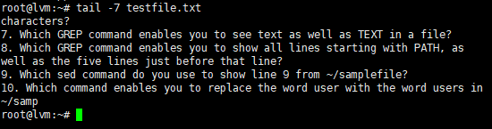
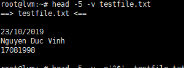
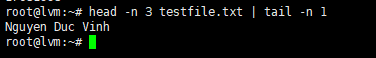
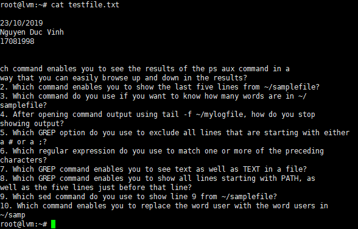
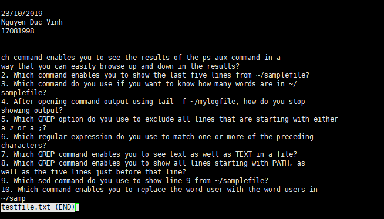
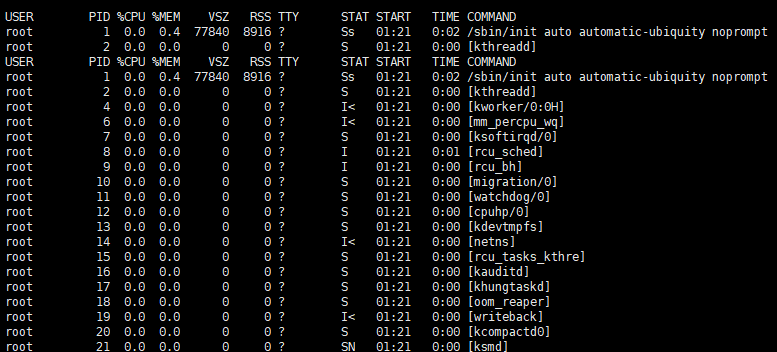
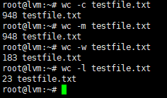
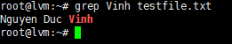
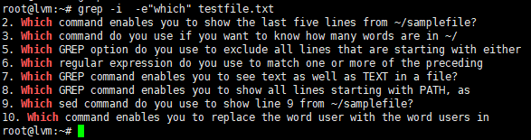
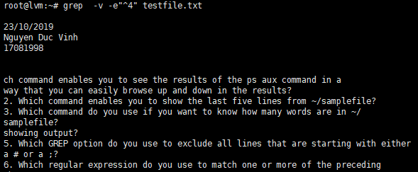

# Làm việc với text file

# Mục lục
*Câu lệnh sử dụng để làm việc với File text*

* 1. Lệnh Head, Tail
* 2. Lệnh Less, Cat
* 3. Lệnh Word count
* 4. Lệnh Grep
* 5. Lệnh cut, sort
* 6. Lệnh awk, sed
* 7. Lệnh vi, vim

---
## Mục đích:
    
*Mục đích của bài viết này là để tìm hiểu các câu lệnh trên giúp bạn làm việc với các file text hiệu quả hơn.*

## 1. Lệnh Head, Tail

* 2 Lệnh này dùng để xem số dòng trong một file text
    * Head: Cho xem các dòng đầu
    * Tail: Cho xem các dòng cuối
* Cấu trúc câu lệnh

    ` head -n file`

    `tail -n file`

* Ví dụ:

thực hiện câu lệnh để xem 7 dòng cuối của file testfile.txt: 

thực hiện câu lệnh xem 5 dòng đầu của file:

thực hiện câu lệnh xem dòng thứ 3 của file 

## 2. Lệnh Less, Cat

* 2 lệnh này dùng để show văn bản của file
    * Less: Mở các text file bằng các trang điều này cho phép đọc file text dễ dàng hơn.
    * Cat: Hiện tất cả nội dung của file text lên màn hình

* Cấu trúc lệnh

    * `less "file" `
        - G : để xem dòng cuối cùng của text file
        - q : Thoát
        - /"*": tìm từ trong file
    
    * `cat "file`

* Ví dụ:
    
    - cat
    

    - less
     

    - xem các process đang chạy:

    

## 3. Lệnh Word count

* Lệnh này sẽ đếm các dòng, các từ, các ký tự trong file
* Cấu trúc câu lệnh
    
    - `wc [option] file`
        
        * -c : đếm byte của file
        * -m : đếm số ký tự của file
        * -w : đếm số từ trong file
        * -l : đếm số dòng trong file

    

## 4. Lệnh Grep

* Câu lệnh dùng để tìm các chuỗi trong file chỉ định.
* grep rất tiện lợi trong việc tìm kiếm thông tin trong các tệp lớn.

* Cách sử dụng:
    
    `grep [option] <file>`

    - -i : không phân biệt chữ hoa chữ thường
    - -v : Chỉ show các dòng không bao gồm các chuỗi 
    - -e : Show những dòng có nội dung cần tìm
    - "^#": S
* Ví dụ:

    - Tìm chuỗi trong file:

    

    - Tìm các dòng chứa các từ bao gồm:

    

    - show không gồm dòng bắt đầu bằng số4

    
    
