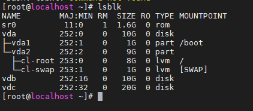
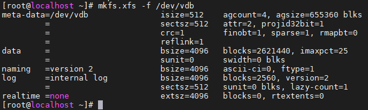
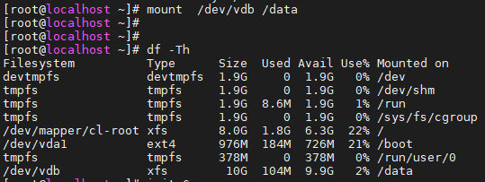
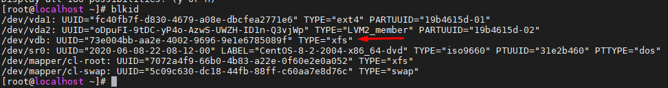
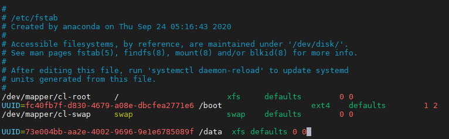
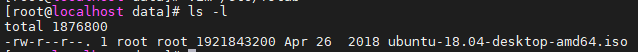
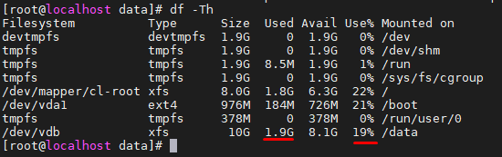

# Cách thực hiện Mount sau khi gắn Volume mới

- Bước 1 kiểm tra các volume đã được gắn thành công vào máy ảo chưa, ta dùng lệnh:
```sh
lsblk
```



*Ta thấy volume `vdb` đã được gắn vào máy ảo nhưng chưa được mount với bất kì thư mục nào trong hệ thống LINUX*

- Bước 2: Thực hiện Tạo file system cho Volume cần mount ,ở đây ta sẽ dùng xfs (hoặc có thể dùng ext4 ):
```sh
mkfs.xfs /dev/vdb
```


- Bước 3 : Ta sẽ tạo một thư mục mới để mount volume với thư mục này.( tùy chọn với thư mục của bạn)
```sh
mkdir /data
```

- Bước 4: Thực hiện mount volume `vdb` với thư mục này 
```sh
mount /dev/vdb /data
```

*Kiểm tra xem đã mount thành công chưa bằng lệnh `df -Th`*



- Đến đây việc mount volume đã thành công, nhưng để cấu hình máy ảo tự nhận volume sau khi reboot ta phải cấu hình file `/etc/fstab` 

- Bước 1: Lấy uuid của volume
```sh
blkid
```


- Bước 2: Cấu hình file `/etc/fstab` thêm vào dòng cuối
```sh
[root@localhost data]# vim /etc/fstab
...
UUID=73e004bb-aa2e-4002-9696-9e1e6785089f /data  xfs defaults 0 0
```


|Field       | Description      |
|------------|------------------|
|Device      | Khai báo Thiết bị sẽ được mount. Có thể khai báo dạng tên thiết bị `/dev/vdb`, `UUID` hoặc `LABEL`|
|Mount Point | Khai báo thư mục mà volume sẽ mount|
|File System | Khai báo type File system|
|Mount Option| Tùy chọn Mount|
|Dump Support| Đây là việc chỉ định tắt bật tiện ích tạo các bản filesystem backups 1(bật)  0 (tắt)|
|Automatic Check| Cách thức kiểm tra filesystem của hệ thống trong quá trình booting, 1(sẽ mặc định check đầu tiên nếu là root filesystem), 2(nếu không phải root file system thì sẽ thực hiện check trong quá trình booting), 0 ( không cần check file system)|


- Bước 3: Thực hiện mount tất cả những gì đã khai báo trong file `/etc/fstab`
```sh
mount -a
```


- Kiểm tra bằng cách đi đến thư mục `/data/` sau đó download 1 file



- Kiểm tra bằng lệnh `df -Th` xem kích thước `vdb` có thay đổi không:


