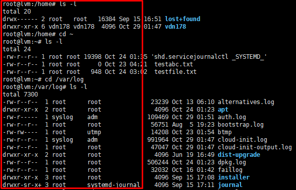
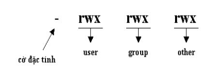
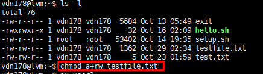
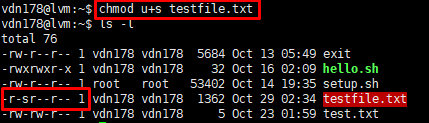
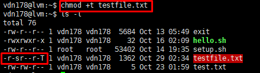

# Phân quyền trong Linux   

## Quyền truy xuất trong Linux

* Để xem quyền truy xuất trong Linux ta dùng câu lệnh `ls -l`

    

* Danh sách quyền truy xuất trình bày ở cột đầu tiên trong kết quả. Các loại quyền truy
xuất gồm:
    - Read ( r ): Cho phép đọc nội dung tập tin và xem nội dung thư mục bằng lệnh ls.
    - write ( w ): Cho phép thay đổi nội dung hoặc xóa tập tin. Đối với thư mục, quyền này cho phép tạo, xóa hoặc đổi tên tập tin mà không phụ thuộc vào quyền sở hữu trên tập tin chứa trong thư mục.
    - execute ( x ): Cho phép thực thi chương trình, đối với thư mục, quyền này cho phép chuyển vào thư mục bằng lệnh cd.

* Quyền truy xuất gồm 3 nhóm:

    

    | Ký hiệu | Kiểu file |
    |---------|-----------|
    | `-` | Regular file |
    | `d` | Directory |
    | `l` | Symbolic link ( Soft link ) |
    | `b` | Block special file |
    | `c` | Character special file |
    | `p` | Named pipe |
    | `s` | Socket |

    - Nhóm 1 : Quyền của người sở hữu ( owner hoặc user ) , ký hiệu bằng kí tự u : người tạo ra thư mục / file hoặc được gán quyền sở hữu .

    - Nhóm 2 : Quyền của nhóm ( group ) ký hiệu bằng kí tự g : nhóm người sử dụng được gắn quyền .

    - Nhóm 3 : Quyền của người dùng khác ( others ) ký hiệu bằng kí tự o : là những người sử dụng khác không thuộc 2 nhóm trên.

*Có 2 cách biểu diễn quyền truy xuất (Chữ và số)*
    
- Quyền truy xuất được viết bằng các ký tự :
        
    - `r` : read
    - `w` : write
    - `x` : execute
    - `-` : không có quyền

- VD :
    - `rwx` : có full quyền
    - `r--` : chỉ có quyền đọc
    - `rw-` : chỉ có quyền đọc và ghi
    - `---` : không có quyền gì

- Quyền hạn trên 1 file sẽ gồm cả 3 nhóm quyền ( owner , group , others ) nên danh sách quyền sẽ gồm 9 kí tự :
    
    - VD :
        - `rwxrw----` : người sở hữu có full quyền , các user cùng nhóm chỉ có quyền đọc/ghi còn mọi người khác không có quyền truy xuất .
        - `rw-r-----` : người sở hữu có quyền đọc/ghi , các user cùng nhóm chỉ có quyền đọc còn mọi người khác không có quyền truy xuất .
        - `rwxr-xr--` : người sở hữu có full quyền , các user cùng nhóm chỉ có quyền đọc và thực thi chương trình còn mọi người khác chỉ có quyền đọc.

* Quyền truy xuất được viết bằng các chữ số :

    | Quyền | Giá trị |
    |-------|---------|
    | `r` | `4` |
    | `w` | `2` |
    | `x` | `1` |

    
    - Mỗi nhóm quyền truy xuất là tổng của các loại quyền trên :

    | Quyền | Ý nghĩa | Biểu diễn bằng số |
    |-------|---------|-------------------|
    | `rwx` | Có full quyền | `7` |
    | `rw-` | Chỉ có quyền đọc và ghi | `6` |
    | `r-x` | Chỉ có quyền đọc và thực thi | `5` |
    | `r--` | Chỉ có quyền đọc | `4` |
    | `---` | Không có quyền gì | `0` |

- Vì quyền thực sự gồm cả 3 nhóm quyền ( **owner , group , others** ) nên danh sách quyền biểu diễn dưới dạng số sẽ gồm `3` chữ số .
    - **VD :** 
        - `rwxrw----` ( `760` ) : người sở hữu có toàn quyền , các user cùng nhóm chỉ có quyền đọc/ghi còn mọi người khác không có quyền truy xuất .
        - `rw-r--r--` ( `644` ) : người sở hữu có quyền đọc/ghi , các user cùng nhóm chỉ có quyền đọc còn mọi người khác không có quyền truy xuất .
        - `rwxr-xr--` ( `754` ) : người sở hữu có toàn quyền , các user cùng nhóm chỉ có quyền đọc và thực thi chương trình còn mọi người khác chỉ có quyền đọc .
       

## Các lệnh về quyền

* Lệnh chmod: Thay đổi quyền truy xuất trên thư mục/tập tin
    - Cấu trúc lệnh:

        `chmod [options] [mode] [file]`
    - Options: 
        - -R: Áp dụng đối với thư mục làm cho lệnh chmod có tác dụng trên cả các thư mục con (đệ quy).
    - Mode: Quyền truy xuất mới trên tập tin

    Quyền truy xuất mới có thể gán cho từng nhóm quyền bằng cách sử dụng ký tự `u` đại diện cho quyền của người sở hữu (owner), `g` đại diện cho quyền của nhóm (group) và `o` đại diện cho quyền của mọi người dùng khác (others). Ký tư “`+`” có ý nghĩa gán thêm quyền, “`-`“ có ý nghĩa rút bớt quyền và “`=`” có nghĩa là gán.
    
    - Ví dụ 1:

        - g+w : thêm quyền ghi cho nhóm
        - o-rwx : loại bỏ tất cả các quyền của mọi người dùng khác
        - u+x : thêm quyền thực thi cho người sở hữu
        - +x : thêm quyền thực thi cho tất cả (mọi người)
        - a+rw : thêm quyền ghi đọc cho tất cả
        - ug+r : thêm quyền đọc cho owner và group
        - o=x : chỉ cho phép thực thi với mọi người

        

* Lệnh chown: Là lệnh thay đổi chủ sở hữu thư mục / tập tin ( owner )
    
    `chown [options] [owner] [file]`
    
    - Options:
        - `-R` : áp dụng đối với thư mục làm cho lệnh `chown` có tác dụng trên cả các thư mục con
    - Owner : chủ sở hữu mới của tập tin
- Có thể thay đổi đồng thời chủ sở hữu và group sở hữu file
    
     `chown [options] [owner]:[group_owner] [file]`

* Lệnh chgrp: Là lệnh thay đổi nhóm sở hữu thư mục / tập tin

     `chgrp [options] [group_owner] [file]`
    
    - Options:
        - `-R` : áp dụng đối với thư mục làm cho lệnh `chgrp` có tác dụng trên cả các thư mục con
    - Group_owner : nhóm sở hữu mới của tập tin

## SUID , SGID

* SUID
    - SUID ( hay Set user ID ) , được sử dụng trên các file thực thi ( executable files ) để cho phép việc thực thi được thực hiện dưới owner của file thay vì thực hiện như user đang login trong hệ thống .

    - SUID cũng có thể được sử dụng để thay đổi ownership của file được tạo hoặc di chuyển nó đến 1 thư mục mà owner của nó sẽ là owner của thư mục chuyển đến thay vì là owner của nó được tạo ra.

        - Thêm SUID: `chmod u+s [file]`

        - Xóa SUID : `chmod u-s [file]`

        

* SGID
    - SGID ( hay Set group ID ) , cũng tương tự như SUID , được sử dụng trên các file thực thi ( excutable files ) để cho phép việc thực thi được thực hiện dưới owner group của file thay vì thực hiện như group đang login trong hệ thống .
    - SGID cũng có thể được sử dụng để thay đổi ownership group của file được tạo hoặc di chuyển nó đến 1 thư mục mà owner group của nó sẽ là owner group của thư mục chuyển đến thay vì là group mà nó được tạo ra .

        - Thêm SGID: `chmod g+s [file]`
        - Xóa SGID: `chmod g-s [file]`

* Sticky Bit
    - Được dùng cho các thư mục chia sẻ , mục đích là ngăn chặn việc người dùng này xóa file của người dùng kia . Chỉ duy nhất owner file và root mới có quyền rename hay xóa các file , thư mục khi nó được set sticky bit.

        - Thêm Sticky Bit: `chmod +t`
        - Xóa Sticky Bit: `chmod o-t`

        
---
## Review Quiz

* How do you use chown to set the group owner to a file?
   
    `chown :groupname filename or chown .groupname filename`

* Which command finds all files that are owned by a specific user?

    `find / -user username`

*  How would you apply read, write, and execute permissions to all files in /data for the user and group owners while setting no permissions to others?

    Cho phép tất cả các quyền cho user và group sở hữu và không cho phép các người dùng khác

    `chmod -R 770 /data`

* Which command enables you in relative permission mode to add the execute permission to a file that you want to make executable?

    `chmod +x file`

* Which command enables you to ensure that group ownership on all new files that will be created in a directory are set to the group owner of that directory?

    `chmod g+s /directory`

* You want to ensure that users can only delete files of which they are the owner, or which are in a directory of which they are the owner. Which command will do that for you?

    Chỉ cho phép người dùng xóa các tệp khi họ là chủ sở hữu:

    `chmod +t /directory`

