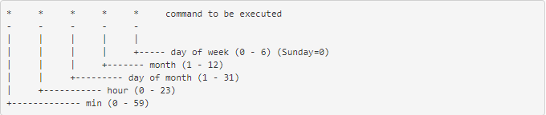

# Sử dụng Crontab 

# Mục lục

* [1. Mục đích sử dụng Crontab](#1)
* [2. Khái niệm và Nguyên lý hoạt động](#2)
* [3. LAB ví dụ](#3)
* [4. Tham khảo](#4)

---

## 1. Mục đích để sử dụng Crontab
* Tính năng của Cron trong Linux là một chế độ sắp xếp tự động các chương trình, ứng dụng và kích hoạt chúng tại một thời điểm nhất định trong hệ thống( tương tự với Task Scheduler của Windows).

* Dính năng này rất phù hợp trong quá trình tự động 
     - Sao lưu dữ liệu 
     - Bảo dưỡng hệ thống
     - Gửi email thống kê cho khách hàng mỗi tuần
     - Xóa những file cache có dung lượng quá lớn hàng tháng

## 2.1. Khái niệm
*Cron là gì?*
*Crontab là gì?*
*Cronjob là gì?*

* Cron là một tiện ích giúp lập lịch chạy những dòng lệnh cho server để thực thi các công việc theo thời gian được lập sẵn.
* Cronjob là các lệnh thực thi hành động đặt trước vào thời điểm nhất định. Crontab là nơi lưu trữ các cronjob.
* Cron là một chương trình deamon, () nó được chạy ngầm mãi mãi một khi nó được khởi động lên). Như các deamon khác thì bạn cần khởi động lại nó nếu như có thay đổi thiết lập gì đó. Chương trình này nhìn vào file thiết lập có tên là crontab để thực thi những task được mô tả ở bên trong.

## 2.2 Nguyên lý hoạt động

* Một cron schedule đơn giản là một text file. Mỗi đường dùng có một cron schedule riêng.
* File này thường nằm ở /var/spool/cron.
* Lệnh thường dùng:
    
    - crontab -e: tạo hoặc chỉnh sửa file crontab
    - crontab -l: Hiển thị file crontab
    - crontab -r: Xóa file crontab.

* Cấu trúc của crontab:

