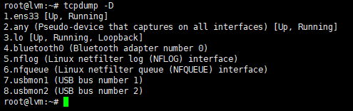
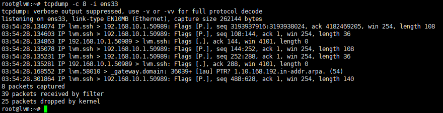

# Tìm hiểu tcpdump trên Linux

1. tcpdump là gì:

 `tcpdump` là phần mềm bắt gói tin trong mạng làm việc trên hầu hết các phiên bản hệ điều hành unix/linux. Tcpdump cho phép bắt và lưu lại những gói tin bắt được, từ đó chúng ta có thể sử dụng để phân tích.

 2. Lệnh cơ bản để thực hiện bắt gói tin trên tcpdump

* Xem các interface đang hoạt động

    `tcpdump -D`

    

* Bắt gói tin trên Interface(-c n theo số gói)

    `tcpdumb -c n -i "interface"`

    

    *Các gói tin ssh*

* Bắt các gói theo port

    `tcpdump -i enp0s3 port 22 -c 5 -n`

    - -n: Hiển thị số port thay cho tên giao thức, IP thay cho Hostname

    

*  Bắt theo địa chỉ nguồn hoặc đích

    - Địa chỉ nguồn:
       
        `tcpdump -i ens33 src 192.168.100.1`

    - Địa chỉ đích: 
        
        `tcpdump -i ens33 dst 192.168.100.1`
