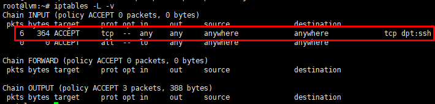

# Iptables Service

## Iptables Service là gì?

* Iptables Service là Firewall được cấu hình và hoạt động trên nền Console rất nhỏ và tiện dụng, Iptables do Netfilter Organiztion viết ra để tăng tính năng bảo mật trên hệ thống Linux. Iptables cung cấp các tính năng sau:

    - Tích hợp tốt với kernel của Linux.
    - Có khả năng phân tích package hiệu quả.
    - Lọc package dựa vào MAC và một số cờ hiệu trong TCP Header. 
    - Cung cấp chi tiết các tùy chọn để ghi nhận sự kiện hệ thống.
    - Cung cấp kỹ thuật NAT.
    - Có khả năng ngăn chặn một số cơ chế tấn công theo kiểu DoS. 
* Iptables cho phép người quản trị Linux cấu hình cho phép chặn luồng dữ liệu đi qua mạng. Iptables có thể đọc, thay đổi, chuyển hướng hoặc hủy các gói tin đi vào và đi ra dựa trên các tables, chains, rules. Mỗi table có nhiều chain chứa các rules khác nhau, quyết định cách thức xử lý gói tin (dựa trên giao thức, địa chỉ nguồn, đích... )
## Cơ chế trong iptables

*Cơ chế lọc gói tin của iptables được xây dựng trên 3 thành phần cơ bản đó là table, chanin, target. Mỗi bảng gắn thêm các chain để xử lý cho mỗi giai đoạn khác nhau và mỗi giai đoạn có thể tạo ra các rules khác nhau.*

### Tables

-  Mangle: chịu trách nhiệm thay đổi các bits chất lượng dịch vụ trong TCP header như TOS (type of service), TTL (time to live), và MARK.

- Filter: chịu trách nhiệm lọc gói dữ liệu. Nó gồm có 3 quy tắc nhỏ (chain) để giúp bạn thiết lập các nguyên tắc lọc gói:

    - Forward chain : lọc gói khi đi đến đến các server khác.
    - Input chain : lọc gói khi đi vào trong server.
    - Output chain: lọc gói khi ra khỏi server.
- NAT: gồm có 2 loại:

    - Pre-routing chain: thay đổi địa chỉ đến của gói dữ liệu khi cần thiết.
    - Post-routing chain: thay đổi địa chỉ nguồn của gói dữ liệu khi cần thiết.

- Raw table:
    - Table lưu lại trạng thái kết nối của các gói tin, xem các gói tin rời rac là một kết nói, một session chung để quản lý.
    - Có thể theo dõi số gói tin nhất định, các gói tin đánh dấu NOTRACK sẽ không được ghi lại trong bảng connection tracking.
- Secure table: 
    - Table này dùng để đánh dấu policy của SElinux lên các gói tin, các dấu này sẽ ảnh hưởng đến cách thức xử lý của SElinux hoặc của cấc máy khác trong hệ thống có áp dụng SELinux.

    - Table này có thể đánh dấu theo từng gói tin hoặc từng kết nối.

### Chain

 * `FORWARD`: Lọc gói dữ liệu đi đến các server khác kết nối trên các NIC khác của firewall

 * `INPUT`: Lọc gói đi đến firewall

 * `OUTPUT`: Lọc gói đi ra khỏi firewall

 * `NAT`: Network Address Translation

 *  `PREROUTING`: Việc thay đổi địa chỉ diễn ra trước khi định tuyến. Thay đổi địa chỉ đích sẽ giúp gói dữ liệu phù hợp với bảng định tuyến của firewall.Sử dụng DestinationNAT hoặc DNAT

 * ` POSTROUTING` Việc thay đổi địa chỉ diễn ra sau khi định tuyến. Sử dụng sourceNAT hoặc SNAT.

 ### Rule
* Các rule là các tập điều kiện và các hành động tương ứng để xủ lý gói tin. Mỗi chain sẽ chứa rất nhiều rule, gói tin đươc sử lý trong một chain sễ được so lần lượt từng rule trong chain.

* Kiểm tra gói tin trên rule rất linh hoạt và có thể dễ dàng mở rộng thêm nhờ các extension. Rule có thể dự trên protocol, địa chỉ IP nguồn/ đích, port nguồn/ đích, card mạng, ....

* Mỗi rule có một hành động để xử lý gói tin, các hành động :

    - ACCEPT: gói tin được chuyển tiếp sang bảng kết tiếp.
    - DROP: gói tin/kết nối sẽ bị hủy, hệ thông không thực thi.
    - REJECT: gói tin bị hủy, hệ thông gửi lại một gói tin khác trả về kết quả lỗi
    - LOG: gói tin khớp với rule sẻ được ghi lại.
    - REDIRECT: chuyển hướng gói tin sang một proxy khác.
    - MIRROR: hoán đổi địa chỉ IP nguồn/ đích của gói tin trước khi gửi gói tin đi
    - QUEUE: chuyển gói in tới chương trình của người dùng qua module của kernel.

 ## Trạng thái kết nối

 Các trạng thái mà hệ thống connection tracking.

* NEW: khi một gói tin được gửi tới và không nằm trong bất kỳ connection nào thì hệ thống dẽ khởi tạo một kết nối mới và găns thẻ NEW cho kết nối này.

* ESTABLISHED: kết nối chuyển từ trạng thái NEW sang ESTABLISHED khi máy chỉ nhận được phẩn hồi từ bên kia.
* RELATED: gói tin gửi không thuộc về kết nối hiên có nhưng liên quan đến một kết nối đang có trên hệ thống, đây có thể là kết nói phụ trợ.
* INVALID : gói tin không có bất kỳ mối quan hệ nào.
* UNTRACKED: gói tin đi qua bảng raw và được xác địn là không cần theo dõi gói này trong bảng connection tracking.
* SNAT: tráng thái được gán cho các gói tin mà địa chỉ người đã bị NAT, dùng bởi hệ thông connection tracking để biết khi nào câng thay đổi địa chỉ gơi tin cho các gói tin trả về.
* DNAT: trạng thái được gán cho các gói tin mà địa chỉ đích đã bị NAT, dùng bởi hệ thông connection tracking dể biết khi nào cần thay đôi địa chỉ cho gói tin gửi đi.

## Cấu trúc câu lệnh
 
Ở Ubuntu, Iptables không phải là một service mà là một chuỗi các câu lệnh nên việc thực hiện kiểm tra khác với hệ điều hành khác.

`iptables -t [table] [command] [match] [target/jump]`

### Command
| Command | Ý nghĩa |
|---------|--------------|
|-t (table)| Chỉ ra tên của bảng mà rule của bạn sẽ dược ghi vào, mặc định là bảng filter|
|-A (append)| Chèn rule vào cuối chain.|
|-I (insert)| Chèn rule theo số thứ tự trong chain, nếu không có số thì mặc đinh là đứng đầu chain|
|-D (delete)| Xóa rule trong chain theo sô thứ tự được đặt|
|-R (replace)| Thay thế rule vào chain theo sô thứ tự dòng|
|-L (list)| Hiển thị toàn bộ rules ở chain| 
|-F (flush)| Xóa toàn bộ rules trong chain| 
|-N (new)| Tạo mới một chain| 
|-P (policy)| Chỉ định policy được sử dụng trong chain.vd: Chỉ có 2 loại là ACCEPT VÀ DROP|

 ### Match 

|Match | Ý nghĩa | Ví dụ| 
|---------|--------------|---------|
|-p (protocol)|Sử dụng protocol nào, tcp, udp, icmp|-p tcp |
|-s (source)| Địa chỉ IP nguồn của gói tin đến| -s 192.168.122.1 |
|-d (destination)| Địa chỉ IP đích của gói tin đi| -d 192.168.122.1|
|-i (in-interface)| Tất cả gói tin đến interface này dều được chấp nhận, thêm "!" trước interface để loại bỏ| -i eth0 | 
|-o (out-interface)| Tất cả gói tin đi ra khỏi interface này, sử dụng cho chain OUTPUT, PREROUTING, POSTROUTING.| -o eth0 |
|--sport (source-port)| Sử dụng port nguồn để chặn hoặc truy cập|  --sport 80|
|--dport (destination-port)| Sử dung port đích để chặn hoặc truy cập| --dport 80 |

### Target.
|Target  | Ý nghĩa | Ví dụ | 
|---------|--------------|---|
|ACCEPT | Cho phép chain thông qua rules|-j ACCEPT|
|DROP | Không cho phép chain thông qua rules| -j DROP|
|REJECT | Làm việc giống DROP nhưng có gửi lại gói tin error message|  -j REJECT| 
|RETURN| Packet sẽ không traverse ở chain hiện tại. Nếu nó là subchain thì nó sẽ quay lại superior chain. Nếu nó là main chain thì policy sẽ được áp dụng.|-j RETURN|
|REDIRECT| Rewrite lại địa chỉ của gói tin | -j REDIRECT|

### Ví dụ
*Mở port SSH 22 để có thể cho phép kết nối SSH ở bất cứ thiết bị nào.* 

Gõ lệnh để kiểm tra : `iptables -L`

 `iptables -I INPUT -p tcp -m tcp --dport 22 -j ACCEPT`

 

 Ở đây đã hiện thêm các tham số mới sau khi thêm câu lệnh
 - -m conntrack: Áp dụng cho các kết nối thuộc module tên là “Connection Tracking“. Module này sẽ có 4 kiểu kết nối là NEW, ESTABLISHED, RELATED và INVALID. Cụ thể là ở quy tắc này chúng ta sẽ sử dụng kiểu RELATED và ESTABLISHED để lọc các kết nối đang truy cập.

- –ctstate RELATED,ESTABLISHED: Khai báo loại kết nối được áp dụng của cái module Connection Tracking mà mình đã nói ở trên.

Để xóa lệnh toàn bộ các quy tắc chứa hành động ACCEPT thì có thể sử dụng lệnh sau:

`iptables -D INPUT -j ACCEPT`
