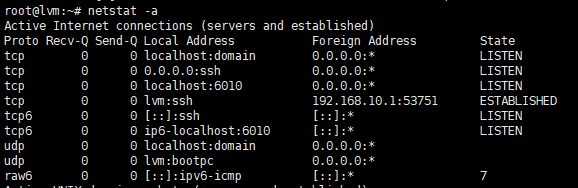
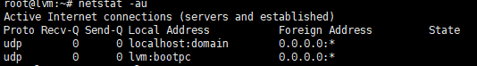
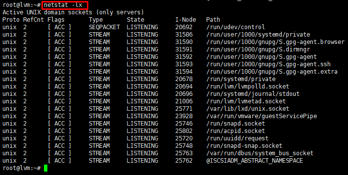
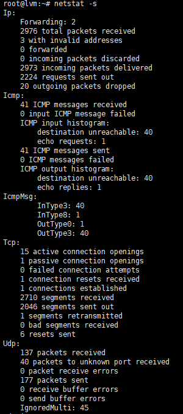
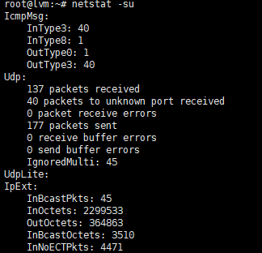
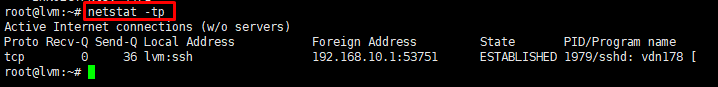
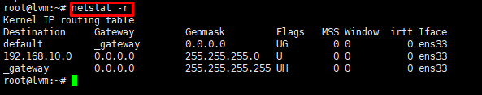
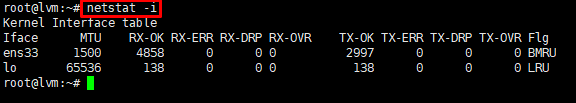
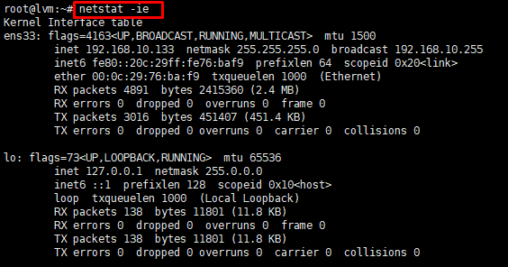
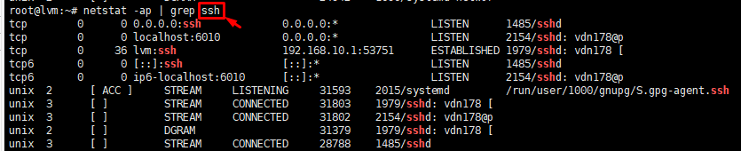

# Tìm hiểu về lệnh Netstat trong Linux để kiểm tra kết nối

## Các lệnh netstat:

1. Hiển thị các port 
    
    `netstat -a` 

    

2. Hiển thị các port dạng kết nối TCP 

    `netstat -at`

    

3. Hiển thị các port dạng kết nối UDP

    `netstat -au`

    

4. Hiển thị tất cả các port ở trạng thái Listening

    `netstat -l` hoặc `netstat -lx` 

    

5.  Thống kê giao thức

    * Thống kê tất cả giao thức:  `netstat -s`

    

    * Thống kê giao thức TCP hoặc UDP:
    TCP : `netstat -st`

        UDP : `netstat -su`

    

6. Hiển thị tên service và PID:

    `netstat -tp`

    

7. Hiển thị thông tin bảng định tuyến

    `netstat -r`

    

8. Hiển thị thôn tin hoạt động của các Network Interface 

    `netstat -i` 

    

9. Hiển thị Kernel Interface Table

    * Hiển thị thông tin IP, giống với lệnh ifconfig.
    
    `netstat -ie`

    

10. Tìm các chương trình ở trạng thái Listening 

    (Đang hoạt động kết nối với hệ thống)

    ` netstat -ap | grep *process* `

    