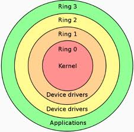

# Overview Linux

# Mục lục
* [1. Khái niệm và lịch sử Linux ]( #1 )

* [2. Quá trình phát triển](#2)

* [3. Kernel](#3)

* [ Tham khảo ](#tk)

---

## 1. Khái niệm và lịch sử của Linux

- Linux là hệ điều hành đa nhiệm người sử dụng.

- Linux là một kernel và được viết dựa trên Unix
    - Linux là phiên bản phân phối tự do của Unix, được phát triển bới Linus Torvalds, người bắt đầu làm việc với Linux vào năm 1991 khi còn là sinh viên đại học Helsinki ở Phần Lan. Linus hiện làm việc cho Transmeta Corporation, một công ty khởi nghiệp ở Santa Calra, California và tiếp tục duy trì nhân Linux (Linux Kernel) - nghĩa là thành phần cốt lõi cấp thấp nhất của hệ điều hành.
    
- Linux là free open-source software , được hỗ trợ bởi cả cộng đồng Linux.

    - Ngày nay, Linux được tác giả và một nhóm hàng ngàn nhà phát triển cộng tác duy trì. Các công ty đã xuất hiện để cung cấp hỗ trợ Linux, để đóng gói thành các bản phân phối dễ cài đặt và bán các máy trạm được cài sẵn với phần mềm Linux. Vào tháng 3 năm 1999, triển lãm thương mại Linux World Expo đầu tiên được tổ chức tại San Jose, California, với hơn 12.000 người tham dự. Hầu hết các ước tính đặt số lượng người dung Linux trên  toàn thế giới ở khoảng 10 triệu người.

## 2. Quá trình phát triển của Linux

- Vào 05/10/1991, Linus đã công bố phiên bản Linux chính thức đầu tiên của Linux, phiên bản 0.02 

    + Linus đã có thể chạy bash (GNU Bourne Again Shell) và ggc ( trình biên dịch GNU C), nhưng không có nhiều hoạt động khác như về đồ họa hướng tới nhu cầu người dùng.

 - Sau phiên bản 0.03, Linus đã tăng số phiên bản lên tới 0.10, khi nhiều người bắt đầu làm việc trên hệ thống
 - Sau nhiều lần sửa đổi, Linus đã tăng số phiên bản lên 0.95, để phản ánh sự kỳ vọng rằng hệ thống đã sẵn dàng cho một bản chính thức ( Nói chung, phần mềm không được gán số phiên bản 1.0 cho đế khi hoàn thành về mặt lý thuyết hoặc không có lỗi)   
 - Ngày nay, Linux là một bản sao Unix hoàn chỉnh, có khả năng chạy X Window System, TCP/IP,Emacs, Web, mail,.. Hầu như tất cả các gói phần mềm miễn phí chính đã được chuyển sang Linux.

    + Nhiều nhà phát triển bắt đầu bằng cách viết các ứng dụng cho Linux và chuyển chúng sang các hệ thống Unix khác sau đó. Nhiều phần cứng được hỗ trợ hơn trong các phiên bản gốc của kernel. 

## 3. Kernel

### Khái niệm:
 - Nhân hệ điều hành (Kernel): là thành phần trung tâm của hầu hết các hệ điều hành máy tính.
- Nó có nhiệm vụ quản lý các tài nguyên hệ thống (liên lạc giữa các thành phần phần cứng và phần mềm).

 - Nhân hệ điều hành thường cung cấp các tiện ích xử lý này cho các tiến trình của các phần mềm ứng dụng qua các cơ chế liên lạc giữa các tiến trình (inter-process communication) và các hàm hệ thống (system call).

### Quy định phiên bản của Linux kernel:
* Phiên bản của Linux có quy định rất đơn giản và dễ nhớ. Vấn đề này cần nắm rõ trước khi chọn một phiên bản nào đó của Linux kernel để vá và biên dịch.

* Phiên bản của Linux bao gồm ba nhóm số tách ra bởi các dấu chấm.
    + *Ví dụ: 2.4.26:*

        + Số thứ nhất: 2 là phiên bản
        + Số thứ nhì: 4 là chỉ định cho tình trạng phiên bản. Nếu số này là số chẵn, nó chỉ định cho phiên bản ổn định (stable), có thể dùng cho môi trường production. Nếu số này là số lẻ, nó chỉ định cho phiên bản không ổn định, nó thường dùng trong môi trường đang phát triển (development). Các kernel thuộc dạng này thường có nhiều bugs và không ổn định. Nếu dùng các phiên bản này để tìm bugs và thông báo cho nhóm phát triển Linux kernel thì đây là điều rất tốt. Không nên dùng phiên bản development cho môi trường production.
        + Số thứ ba: 26 là chỉ định cho số hiệu phát hành của một phiên bản Linux kernel. Một phiên bản ổn định của một Linux kernel có thể có nhiều số hiệu phát hành khác nhau.

### Protection Rings:
* Hierarchical Protection Domains (hay Protection Rings) là cơ chế nhằm bảo vệ dữ liệu và chức năng của một chương trình tránh khỏi nguy cơ lỗi hoặc bị truy cập trái phép bởi các chương trình khác.

* Một Protection Ring là một mức độ (mode/level/layer) truy cập tài nguyên hệ thống. Số lượng Ring tùy thuộc vào kiến trúc CPU và hệ điều hành chạy trên kiến trúc đó có khả năng hỗ trợ bao nhiêu Ring.

* Các Ring được sắp xếp có thứ bậc, từ mức có nhiều đặc quyền nhất (dành cho trusted-software, thường được đánh số 0) đến mức có ít đặc quyền nhất (dành cho untrusted-software, được đánh số cao nhất). 

* Thông thường thì chỉ sử dụng 2 ring:
    
    - Kernel mode(ring 0): Là một chế độ hoạt động ở CPU.
        - Nếu 1 chương trình hoạt động trong Kernel Mode thì nó sẽ có thể nắm quyền sử dụng mọi tài nguyên hệ thống như: sử dụng được tất cả các chỉ lệnh CPU, truy cập tới mọi vùng nhớ trong RAM…
    - User mode (ring 3): 
        - Các chương trình nằm trong User Mode thì ít có đặc quyền truy cập tới tài nguyên hệ thống như: số lượng các chỉ lệnh CPU được sử dụng bị giới hạn, bị cấm truy cập tới vùng nhớ được cấp phát cho Kernel và các chương trình khác…

        - Tất cả các phần mềm ứng dụng lớp người dùng (thuộc untrusted software) khi mới được khởi chạy đều được đưa vào vùng User Mode.

---

## Tham khảo:
[1] https://vi.wikipedia.org/wiki/H%E1%BA%A1t_nh%C3%A2n_Linux

[2] https://www.oreilly.com/library/view/running-linux-third/156592469X/ch01s02.html

[3] https://manthang.wordpress.com/2010/10/30/co-che-protection-rings-trong-bao-mat-may-tinh/
