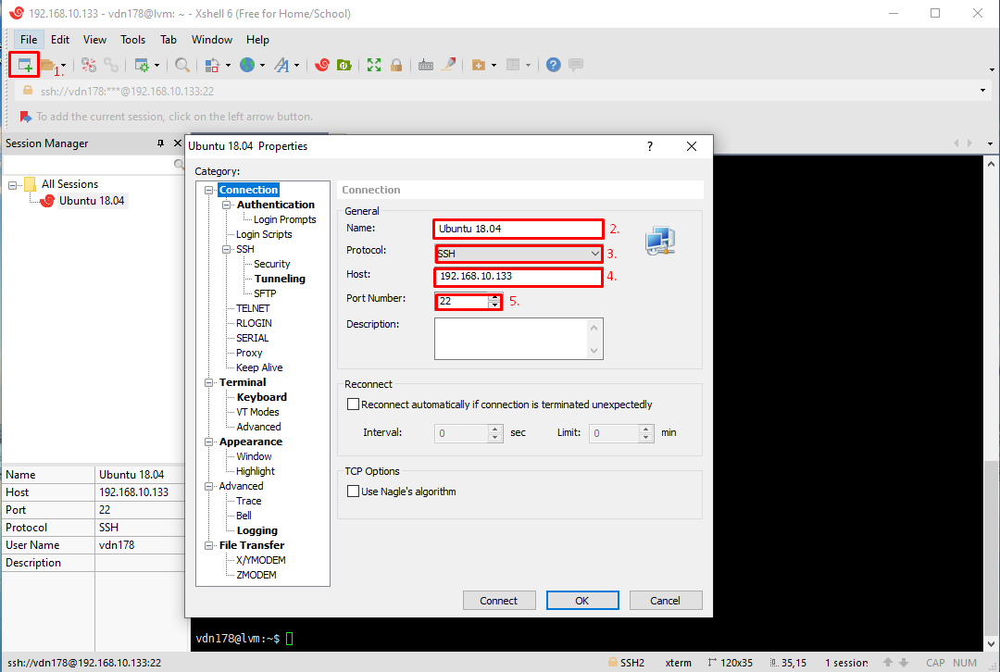
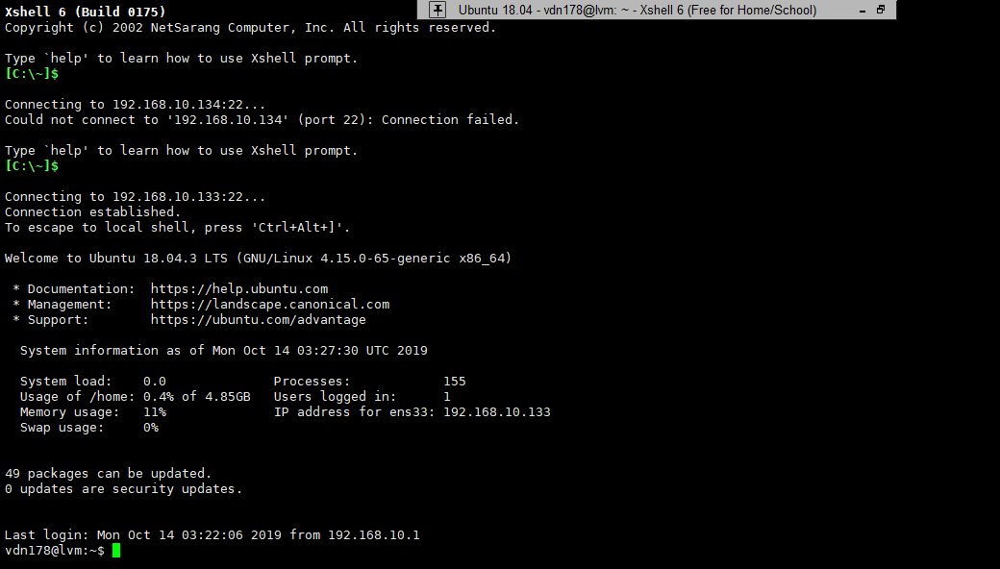
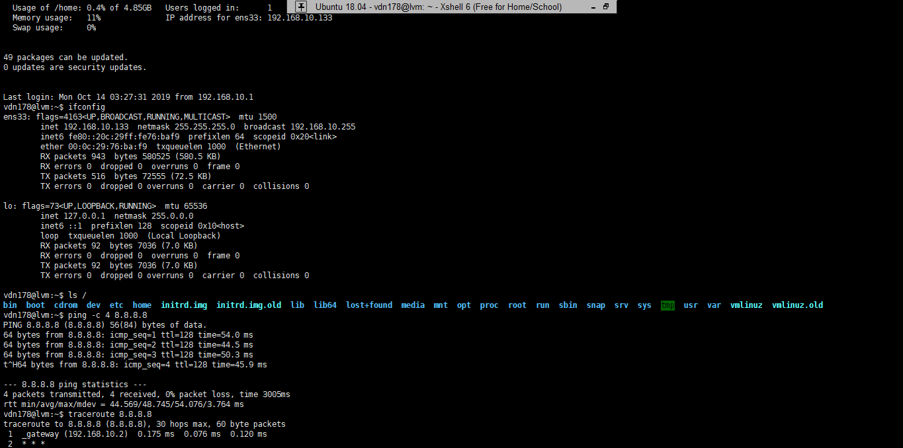

# Cách dùng SSH để remote Server

## SSH
* SSH - Secure Shell là một giao thức mạng dùng để thiết lập kết nối mạng một cách bảo mật .
* SSH có sử dụng cơ chế mã hoá đủ mạnh nhằm ngăn chặn các hiện tượng nghe trộm , đánh cắp thông tin trên đường truyền . Các giao thức trước đây như rlogin , telnet không hỗ trợ mã hóa .
* SSH hoạt động ở tầng Application trong mô hình TCP/IP
* Các công cụ SSH ( như là OpenSSH, Xshell, Putty,...) cung cấp cho người dùng cách thức để thiết lập kết nối mạng được mã hoá để tạo một kênh kết nối riêng tư .
## Thực hiện
* Bật server Ubuntu 18.04 LTS ở VMware Workstation
* Bật Xshell :
    

    * 1. Thêm Session
    * 2. Tên Session
    * 3. Protocols(Vd: SSH, Telnet,...)
    * 4. Địa chỉ ip của server ( xem ở server)
    * 5. Port Number cho phiên hoạt động của SSH

    

    * Đăng nhập tên tài khoản và mật khẩu của server.

    
     * alt + enter: Phóng to/nhỏ

     

