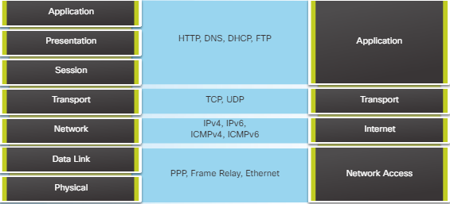

# OSI Model

## 1. Khái niệm cơ bản
* Là một mô hình được tạo ra bởi tổ chức International Organization for Standardization (ISO) 
* Nhằm cho phép các hệ thống truyền thông đa dạng có thể giao tiếp bằng các giao thức chuẩn, cung cấp một tiêu chuẩn cho các máy tính có thể giao tiếp được với nhau
* OSI là một mô hình cho phép nhận biết và thiết kế một kiến trúc mạng linh động, vững chắc và có khả năng liên tác.

