# Sử dụng Glance

## *Mục lục*

- [1. Liệt kê và lấy thông tin về các images](#1)

- [2. Cấu hình hệ thống lưu trữ backend cho các images](#2)

- [3. Cấu hình file log của glance](#3)

- [4. Thao tác với Glance bằng API](#4)
    
<a name="1"></a>
## 1. Liệt kê và xem thông tin về images

- Dùng câu lệnh để hiện danh sách images:

```
glance image-list
```
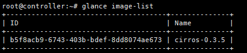

- Hiện thông tin của 1 image dùng lệnh: 
```
glance images-show <image_id>
```
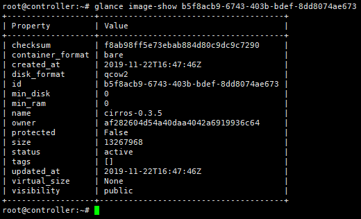

<a name="2"></a>
## 2. Cấu hình hệ thống lưu trữ backend cho các images

*Để cấu hình hệ thống backend lưu trữ các images trong glance, tiến hành chỉnh sửa section [glance_store] trong file `/etc/glance/glance-api.config`

```
[glance_store]
stores = file,http
default_store = file
filesytem_store_datadir = /var/lib/glance/images/
```

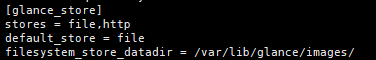

Ví dụ như trong cấu hình trên, ta cho phép hai hệ thống backend lưu trữ image là file và http, trong đó sử dụng hệ thống backend lưu trữ mặc định là file. Cấu hình thư mục lưu trữ các file images khi tải lên glance bằng biến filesystem_store_datadir. Ví dụ ở đây ta cấu hình lưu trong thư mục /var/lib/glance/images/.

- Kiểm tra thử thư mục lưu trữ image:
```
ls -l /var/lib/glance/images
```

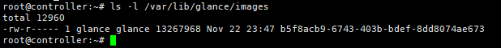

=> Ở đây có một image lưu trữ với kích thước cỡ 13MB.

- Thông tin về nơi lưu trữ images có thể truy vấn trong bảng `image_locations` của database

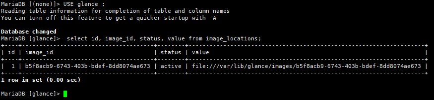

Hoặc

- Dùng lệnh `select * from glance.image_locations\G` trong database

<a name="3"></a>
## 3. Cấu hình file log của glance

- File lưu log mặc định trong thư mục `/var/log/glance/`:

    - `glance-api.log`: ghi lại lịch sử truy cập api server
    - `glance-registry.log`: ghi lại lịch sử liên quan tới registry server.

    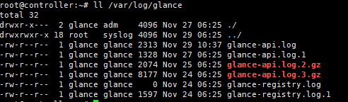


Để thay đổi file log mặc định, thực hiện chỉnh sửa cấu hình trong file `/etc/glance/glance-api.conf.`

- Điều chỉnh tham số `log_file` và `log_dir`.

```
[DEFAULT]
log_file = /var/log/glance/glance_log_vinhtest.log
```

- Lưu lại file cấu hình, thực hiện khởi động lại glance-api server:

```
sudo glance-control api start glance-api.conf
```

- Kiểm tra lại :
    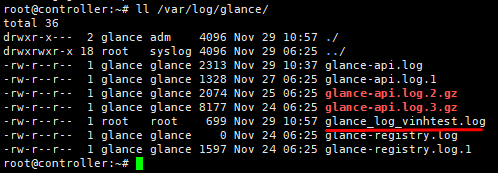
tham số log_dir sẽ thiết lập thưc mục lưu trữ các file log, nếu không thiết lập giá trị này, thì file log sẽ được lưu trong đường dẫn tuyệt đối chỉ ra bởi tham số log_file

<a name="4"></a>
## 4. Thao tác với glance bằng API

- Upload một image lên thư mục lưu trữ glance

    - Thực hiện tải file image có sẵn trên internet
    ```
     wget http://releases.ubuntu.com/16.04/ubuntu-16.04.6-server-amd64.iso
    ```

    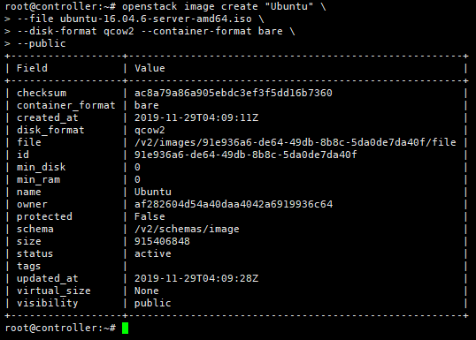

- Kiểm tra các trạng thái của images:
```
openstack images list
```
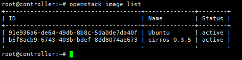

- Xem thông tin image:
```
openstack image show Ubuntu
```
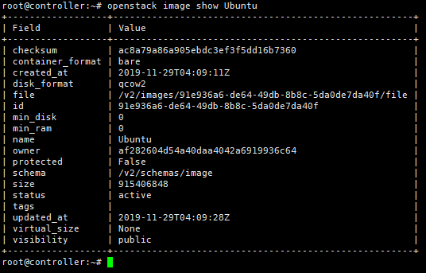


Kiểm tra trên Dashboard

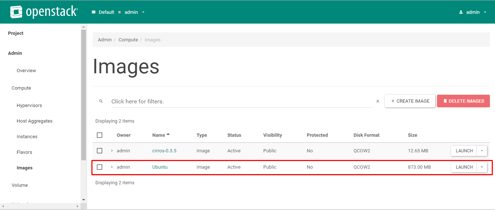
