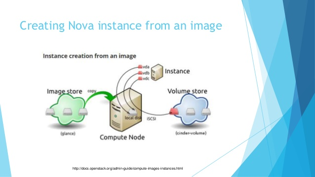

# Tìm hiểu về Glance trong OpenStack

## *Mục lục*
[1. Giới thiệu về Glance](#1)

[2. Các thành phần của Glance](#2)

[3. Kiến trúc của Glance](#3)

[4. Glance images format](#4)

[5. Luồng trạng thái của image trong Glance](#5)

[6. Image và Instance](#6)

[7. Glance image cache](#7)

[Tham khảo](#tk)

## 1. Giới thiệu về Glance 

- Glance là Image servicé của Openstack bao gồm việc tìm kiếm, đăng ký, thu nhập các images của các máy ảo. Glance là một reposity tập trung của các image ảo.

- Glance cung cấp RESTful API cho phép truy vấn metadata của image máy ảo cũng như thu thập các image thực sự.

- Images của máy ảo thông qua Glance có thể lưu trữ ở nhiều vị trí khác nhau từ hệ thống file thông thường cho đến hệ thống oject storage (project SWIFT)

- Trong Glance, các images được lưu trữ giống như các template. Các Template này sử dụng để vận hành máy ảo mới. Glance là giải pháp để quản lý các disk image trên cloud.

- Nó cũng có thể tạo các bản snapshots từ các máy ảo đang chạy để thực hiện dự phòng cho các VM và trạng thái các máy ảo đó.

## 2. Các thành phần của Glance

- Glance bao gồm các thành phần :

    - Glance API: tiếp nhận lời gọi API từ các project khác để tìm kiếm, thu thập và xuất images.
    - Glance registry: Thực hiện các tác vụ lưu trữ, xử lý và thu nhập metadata của images. (giờ đã không còn sử dụng)

    - Database: Cơ sở dữ liệu lưu trữ metadata của images.

    - Storage reposity: được tích hợp với nhiều thanh phần khác trong Openstack như hệ thống file thông thường, Amazon và HTTP phục vụ cho chức năng lưu trữ images

## 3. Kiến trúc Glance

- Glance có kiến trúc client-server và cung cấp RESTful API thông qua đó yêu cầu đến server được thực hiện.

- Yêu cầu từ client được tiếp nhận thông qua RESTful API và đợi sự xác thực của Keystone.

- Glance store driver là lớp giao tiếp giữa glance và hệ thống backend bên ngoài hoặc hệ thống lưu trữ local, cung cấp giao diện chung để truy cập. Glance sử dụng SQL database làm điểm truy cập cho các thành phần khác trong hệ thống.

- Kiến trúc Glance bao gồm các thành phần sau:
    - Client: Ứng dụng sử dụng Glance Server
    - REST API: gửi yêu cầu tới Glance 
    - Database Abstraction Layer (DAL): Là một API thống nhất việc giao tiếp giữa GLance và databases.
    - Glance Domain controller : là middleware triển khai các chức năng chính của Glance: ủy quyền, thông báo, các chính sách, kết nối cơ sở dữ liệu.
    - Glance Store: tổ chức việc tương tác giữa Glance và các hệ thống lưu trữ dữ liệu.

    - Registry Layer: lớp tùy chọn tổ chức việc giao tiếp một cách bảo mật giữa domain và DAL nhờ việc sử dụng một dịch vụ riêng biệt.

    

## 4. Glance image format

- Khi upload một image lên Glance, ta cần xác định định dạng của image máy ảo VM. Glance hỗ trợ nhiều loại định dạng đĩa (Disk format) và định dạng container (Container format). Virtual disk giống với các driver boot máy vật lý, chỉ khác là tất cả gộp lại trong một file. Các nền tảng ảo hóa khác nhau cũng hỗ trợ các định dạng disk format khác nhau.

- **DISK FORMATS**

    - Định dạng đĩa - disk format của một image máy ảo nằm dưới dạng disk image.
    - Hiểu như là định dạng xác định các quy định cách tổ chức các phân vùng , cấu trúc của phần cứng đĩa và cách mà các hypervisor làm việc với image.

    - Những định dạng disk format được hỗ trợ bởi Glance

    |Disk Format|Notes
    |------|------------|
    |Raw| Định dạng đĩa phi cấu trúc|
    |VHD| ĐỊnh dạng chung hỗ trợ bởi nhiều công nghệ ảo hóa trong Openstack( trừ KVM)|
    |VMDK| Định dạng hỗ trợ bởi VMware|
    |qcow2| Định dạng đĩa QEMU, định dạng mặc định hỗ trợ bởi KVM và QEMU, hỗ trợ các chức năng nâng cao|
    |VDI|ĐỊnh dạng ảnh đĩa ảo hỗ trở bở Virtual Box|
    |ISO| Định dạng lưu trữ cho đĩa quang|
    |AMI, ARI, AKI| Định dạng ảnh Amazon machine, ramdisk, kernel|

## 5. Luồng trạng thái của image trong Glance

- Luồng trạng thái của Glance cho biết trạng thái của image trong quá trình tải lên. Khi tạo một image, bước đầu tiên là queing, image được đưa vào hàng đợi trong một khoảng thời gian ngắn, được bảo vệ và sẵn sàng để tải lên. Sau khi queuing, image chuyển sang trạng thái saving nghĩa là quá trình tải lên chưa hoàn thành. Một khi image được tải lên hoàn toàn, trạng thái image chuyển sang Active. Khi quá trình tải lên thất bại nó sẽ chuyển sang trạng thái bị hủy hoặc bị xóa

Các trạng thái của image:

- **queued**:
Định danh của image được bảo vệ trong Glance registry. Không có dữ liệu nào của image được tải lên Glance và kích thước của image không được thiết lập rõ ràng sẽ được thiết lập về zero khi khởi tạo.

- **saving** : Trạng thái này biểu thị rằng dữ liệu thô của image đang upload lên Glance. Khi image được đăng ký với lời gọi POST /images và có một header đại diện x-image-meta-location, image đó sẽ không bao giờ được đưa và trạng thái "saving" (bởi vì dữ liệu của image đã có sẵn ở một nơi nào đó)

- **active**: 
Biểu thị rằng một image đã sẵn sàng trong Glance. Trạng thái này được thiết lập khi dữ liệu của image được tải lên hoàn toàn.

- **deactivated**:
Trạng thái biểu thị việc không được phép truy cập vào dữ liệu của image với tài khoản không phải admin. Khi image ở trạng thái này, ta không thể tải xuống cũng như export hay clone image.

- **killed**: Trạng thái biểu thị rằng có vấn đề xảy ra trong quá trình tải dữ liệu của image lên và image đó không thể đọc được

- **deleted**: Trạng thái này biểu thị việc Glance vẫn giữ thông tin về image nhưng nó không còn sẵn sàng để sử dụng nữa. Image ở trạng thái này sẽ tự động bị gỡ bỏ vào ngày hôm sau.

- **pending_delete**: Tương tự như trạng thái deleted, tuy nhiên Glance chưa gỡ bỏ dữ liệu của image ngay. Một image khi đã rơi vào trạng thái này sẽ không có khả năng khôi phục.

## 6. Image và Instance

 - Disk images được lưu trữ giống như các template. Image service kiểm soát việc lưu trữ và quản lý của các images. Instance là một máy ảo riêng biệt chạy trên compute node, compute node quản lý các instances. User có thể vận hành bao nhiêu máy ảo tùy ý với cùng một image. Mỗi máy ảo đã được vận hành được tạo nên bởi một bản sao của image gốc, bởi vậy bất kỳ chỉnh sửa nào trên instance cũng không ảnh hưởng tới image gốc. Ta có thể tạo bản snapshot của các máy ảo đang chạy nhằm mục đích dự phòng hoặc vận hành một máy ảo khác.

- Khi ta vận hành một máy ảo, ta cần phải chỉ ra flavor của máy ảo đó. Flavor đại diện cho tài nguyên ảo hóa cung cấp cho máy ảo, định nghĩa số lượng CPU ảo, tổng dung lượng RAM cấp cho máy ảo và kích thước ổ đĩa không bền vững cấp cho máy ảo. OpenStack cung cấp một số flavors đã định nghĩa sẵn, ta có thể tạo và chỉnh sửa các flavors theo ý mình.

- Sơ đồ dưới đây chỉ ra trạng thái của hệ thống trước khi vận hành máy ảo. Trong đó image store chỉ số lượng các images đã được định nghĩa trước, compute node chứa các vcpu có sẵn, tài nguyên bộ nhớ và tài nguyên đĩa cục bộ, cinder-volume chứa số lượng volumes đã định nghĩa trước đó.

- Trước khi vận hành 1 máy ảo, ta phải chọn một image, flavor và các thuộc tính tùy chọn. Lựa chọn flavor nào cung cấp root volume, có nhãn là vda và một ổ lưu trữ tùy chọn được đánh nhãn vdb (ephemeral - không bền vững) và cinder-volumen được map với ổ đĩa ảo thứ ba, có thể gọi tên là vdc.

 - image gốc được copy vào ổ lưu trữ cục bộ từ image store. Ổ vda là ổ đầu tiên mà máy ảo truy cập. Ổ vdb là ổ tạm thời (không bền vững - ephemeral) và rỗng, được tạo nên cùng với máy ảo, nó sẽ bị xóa khi ngắt hoạt động của máy ảo. Ổ vdc kết nối với cinder-volume sử dụng giao thức iSCSI. Sau khi compute node dự phòng vCPU và tài nguyên bộ nhớ, máy ảo sẽ boot từ root volume là vda. Máy ảo chạy và thay đổi dữ liệu trên các ổ đĩa. Nếu volume store được đặt trên hệ thống mạng khác, tùy chọn "my_block_storage_ip" phải được dặc tả chính xác trong tệp cấu hình storage node chỉ ra lưu lượng image đi tới compute node.

- Khi máy ảo bị xóa, ephemeral storage (khối lưu trữ không bền vững) bị xóa; tài nguyên vCPU và bộ nhớ được giải phóng. Image không bị thay đổi sau tiến trình này.

## 7. Glance image cache

- Việc kích hoạt Glance cache thường được khuyên khi sử dụng hệ thống lưu trữ mặc định là file, tuy nhiên nếu sử dụng Ceph RBD backend sẽ có một số khác biệt.

- Kích hoạt glance cache dẫn tới việc tạo ra cached của image đó trong thư mục /var/lib/glance/image-cache mỗi lần boot máy ảo lên. Giả sử ta có một máy ảo với kích thước VM image là cỡ 50GB, nếu như mỗi lần boot mà lại tạo cached như vây, hệ thống lưu trữ sẽ sớm bị cạn kiệt, trừ khi ta mount thư mục /var vào một ổ lưu trữ lớn.

- Glance API server có thể được cấu hình để có thư mục lưu trữ image cache local. Một thưc mục local image cache lưu trữ một bản copy của các image, về cơ bản điều này cho phép nhiều API server phục vụ cùng các file image giống nhau, để mở rộng khả năng phục vụ của Glance.

- Local image cache là trong suốt với người dùng. Người dùng cuối không biết được Glance API đang chuyển các file image từ local cache hay từ hệ thống backend lưu trữ thực sự.

---

 ## Tham khảo

 https://github.com/thaihust/Thuc-tap-thang-03-2016/blob/master/ThaiPH/OpenStack/Glance/ThaiPH_baocaotimhieuglance.md#manage_image