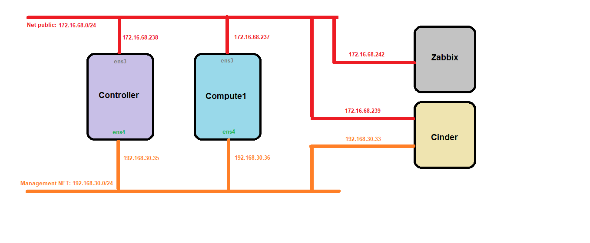
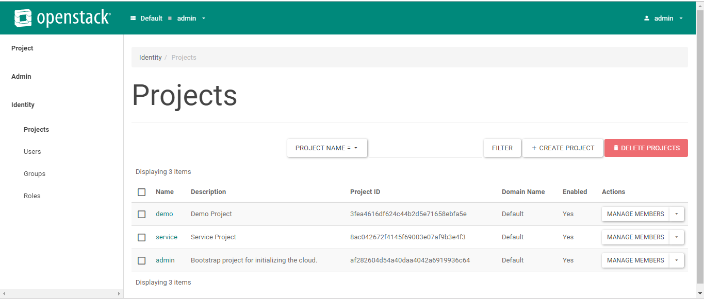

# Install Openstack with script

Yêu cầu:
 - Cài đặt trên Ubuntu Server 16.04 64bits LTS - Mỗi máy đều có 02 NIC: public + private
 - Mặc định các script đều cài OpenStack với OpenvSwitch.
 - Mô hình : Ở đây tôi thực hiện cài đặt 2 node : controller và compute1
 

 - Thực hiện cấu hình địa chỉ IP tĩnh cho các node:

```
vim /etc/network/interfaces

# loopback network interface
auto lo
iface lo inet loopback

# external network interface
auto ens3
iface ens3 inet static
address 172.16.68.238
netmask 255.255.255.0
gateway 172.16.68.1
dns-nameservers 8.8.8.8 8.8.4.4

# internal network interface
auto ens4
iface ens4 inet static
address 192.168.30.35
netmask 255.255.255.0
```

- Reset lại card mạng 

```
ifdown -a && ifup -a 
```
Làm theo các bước tiếp theo trong đây :

https://github.com/TrongTan124/install-OpenStack/blob/master/Ubuntu1604-install-queens-OVS.md

kết quả :



---

## Tham khảo:

https://github.com/TrongTan124/install-OpenStack