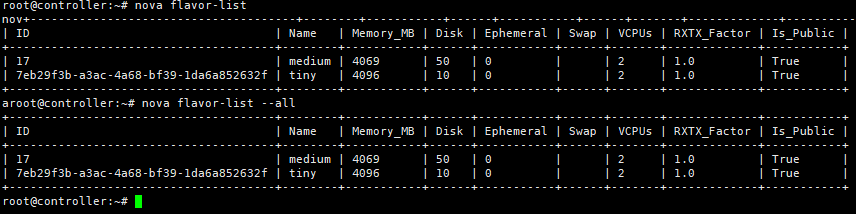
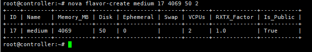
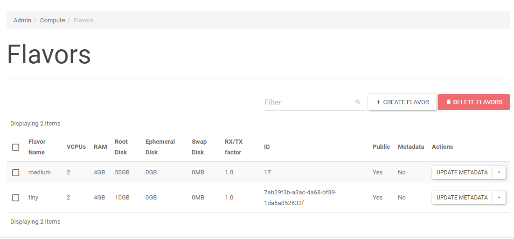
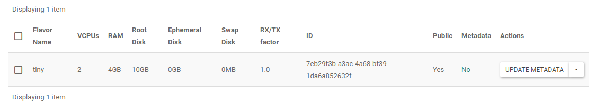
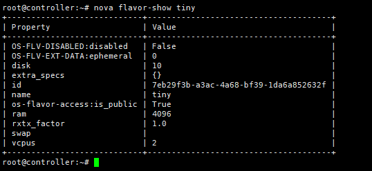
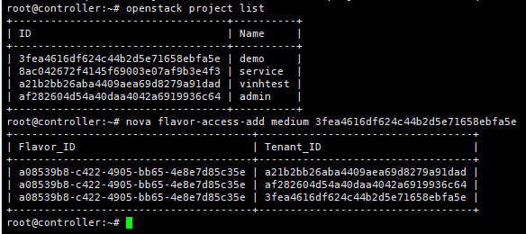
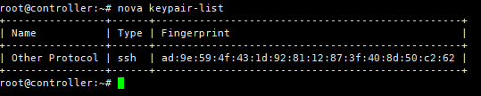
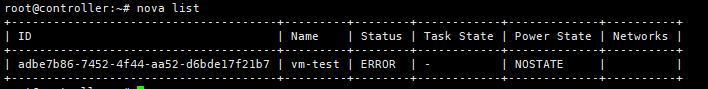

# Thao tác với Nova project

## *Mục lục*:

- [1. Nova command](#1)
    - [1.1 Nova flavor](#1.1)
    - [1.2 Nova Keypair](#1.2)
    - [1.3 Nova instance](#1.3)
    - [1.4 Nova interface](#1.4)
    - [1.5 Nova secutiry group](#1.5)

- [2. Openstack Client command](#2)
    - [2.1 Nova flavor](#2.1)
    - [2.2 Nova keypair](#2.2)
    - [2.3 Nova instance](#2.3)

    ---
<a name="1"></a>
## 1. Nova command

*Có thể sử dụng sau khi cài đặt gói python-novaclient*

<a name="1.1"></a>
### 1.1 Nova flavor
- List flavor

```
nova flavor-list 

Hoặc

nova flavor-list --all
```


- Creat flavor 

``` 
nova flavor-create [--ephemeral <ephemeral>] [--swap <swap>] [--rxtx-factor <factor>] [--is-public <is-public>] <name> <id> <ram> <disk> <vcpus>
```

Ví dụ: 
```
nova flavor-create medium 17 4069 50 2
```



kiểm tra trên dashboard



- Xóa flavor:

```
nova flavor-delete medium
```
kiểm tra trên dashboard



- Hiển thị thông tin flavor

```
nova flavor-show tiny
```



- Hiển thị list những tenant đã access vào flavor

```
nova flavor-access-list --flavor tiny
```

- Add access flavor vào project

```
nova flavor-access-add tiny <id_project>

```

Ví dụ thực hiện add flavor medium vào project demo



```
nova flavor-access-remove medium <id_project>
```

<a name="1.2"></a>
### 1.2 Nova Keypair-list



```
nova keypair-list
```

<a name="1.3"></a>
### 1.3 Nova Instance

- Xem các vm tồn tại



```
nova list
```

- Xem thông tin vm 
```
nova show <name>
```

- Thay đổi thông tin instance

```
nova update [--name <name>] [--description <description>] <server>
```

- Delete instance
```
nova delete <name-id>
```
- Start instance
```
nova start <name-id>
```
- Stop instance (Shuftoff)
```
nova stop <name-id
```
- Suspend instance
```
nova suspend <name-id>
```
- Resume instance
```
nova resume <name-id>
```
- Reboot instance
Cú pháp:
```
nova reboot [--hard] [--poll] <server> [<server> ...]
```
- Resize instance
Cú pháp:

```
nova resize [--poll] <server> <flavor>
```
- Tạo bản snapshot
Cú pháp:
```
nova image-create [--metadata <key=value>] [--show] [--poll]<server><name>
```

<a name="2"></a>
## 2. Lệnh Openstack Client
```
source admin-opensrc*
```
<a name="2.1"></a>
### 2.1.Nova flavor
- List flavor
```
openstack flavor list

Hoặc

openstack flavor list --all
```


- Create flavor

```
openstack flavor create
    [--id <id>]
    [--ram <size-mb>]
    [--disk <size-gb>]
    [--ephemeral-disk <size-gb>]
    [--swap <size-mb>]
    [--vcpus <num-cpu>]
    [--rxtx-factor <factor>]
    [--public | --private]
    [--property <key=value> [...] ]
    [--project <project>]
    [--project-domain <project-domain>]
    <flavor-name>
```

```
openstack flavor create --ram 1024 --disk 1 --vcpus 2 medium-flavor
```

- Delete flavor:
```
openstack flavor delete medium
```
- Show thông tin flavor:
```
openstack flavor show medium
```


<a name="2.3"></a>
### 2.3.Nova instance

- Xem list các vm

```
openstack server list
```

- Xem thông tin vm

```
openstack server show <name-id>
```
- Thay đổi thông tin instance
```
openstack server set
    --name <new-name>
    --property <key=value>
    [--property <key=value>] ...
    --root-password
    --state <state>
    <server>
```
- Delete instance
```
openstack server delete <name-id>
```
- Start instance
```
openstack server start <name-id>
```
- Stop instance (Shuftoff)
```
openstack server stop <name-id>
```
- Suspend instance
```
openstack server suspend <name-id>
```
- Resume instance
```
openstack server resume <name-id>
```
- Reboot instance
Cú pháp:
```
openstack server reboot
    [--hard | --soft]
    [--wait]
    <server>
```
- Resize instance
Cú pháp:
```
openstack server resize
    --flavor <flavor>
    [--wait]
    <server>
 ```
- Tạo bản snapshot
Cú pháp:
```
openstack server image create
    [--name <image-name>]
    [--wait]
    <server>
    ```