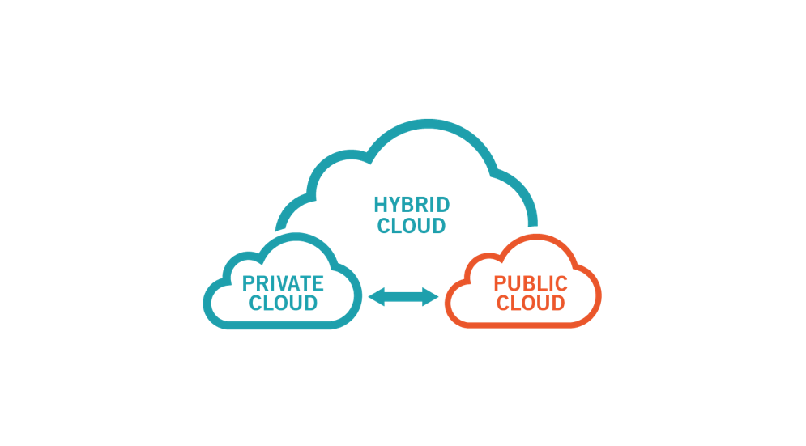
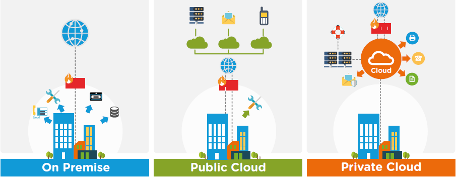
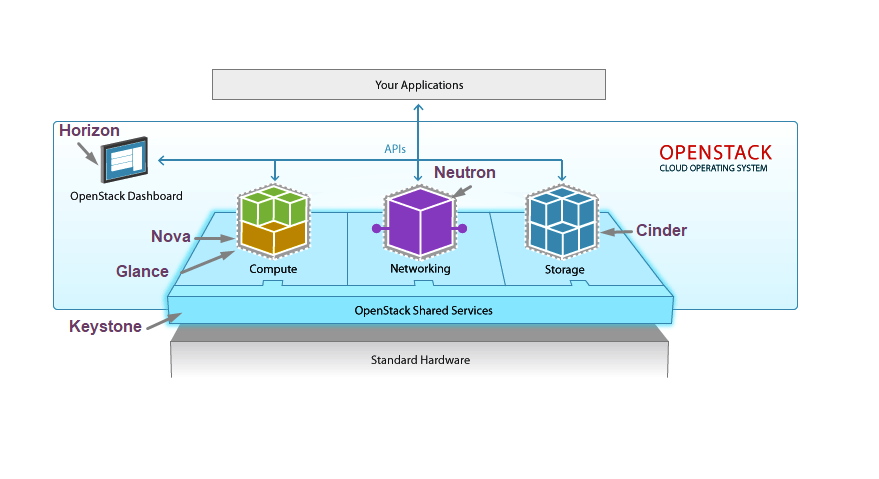

# Tìm hiểu về Cloud computing và OpenStack

## Mục lục

* [Cloud Computing ](#1)

    - [Đặc điểm](#2)
    - [Lợi ích](#3)
    - [Mô hình dịch vụ](#4)
    - [Mô hình triển khai](#5)
* [OpenStack](#6)
    - [Khái niệm](#7)
    - [Thành phần trong OpenStack](#8)
    
##  Cloud Computing 

###  **Cloud Computing là gì?**

* Cloud computing (Điện toán đám mây) là mô hình truy cập qua mạng Internet để lựa chọn và sử dụng tài nguyên có thể tính toán ( ví dụ: mạng, máy chủ, lưu trữ, ứng dụng và dịch vụ) theo nhu cầu một cách thuận tiện và nhanh chóng; đồng thời cho phép kết thúc sử dụng dịch vụ, giải phóng tài nguyên dễ dàng, giảm thiểu các giao tiếp với nhà cung cấp.

* Điện toán đấm mây đơn giản chỉ là một tập hợp các tài nguyên máy tính gộp lại và cung cấp dịch vụ trên các kênh web. Khi chúng ta biểu đồ mối quan hệ giữa tất cả các yếu tố thì chúng tương tự như một đám mây.

### **5 đặc điểm của Cloud Computing**

***5 Đặc Điểm:***

* Khả năng thu hồi và cấp phát tài nguyên (Rapid elasticity)

* Truy nhập qua các chuẩn mạng (Broad network access)

* Dịch vụ sử dụng đo đếm được (Measured service,)

* Khả năng tự phục vụ (On-demand self-service).

* Chia sẻ tài nguyên (Resource pooling).

*Lợi ích*

* Sử dụng các tài nguyên tính toán động.
* Giảm thiểu chi phí.
* Giảm độ phức tạp trong cơ cấu của doanh nghiệp.
* Tằng khả năng sử dụng tài nguyên tính toán

### **4 Mô hình triển khai **

* Public Cloud: là các dịch vụ trên nền tảng Cloud Computing để cho các cá nhân và tổ chức thuê, họ dùng chung tài nguyên.

* Private Cloud: dùng trong một doanh nghiệp và không chia sẻ với người dùng ngoài doanh nghiệp đó

* Community Cloud: là các dịch vụ trên nền tảng Cloud computing do các công ty cùng hợp tác xây dựng và cung cấp các dịch vụ cho cộng đồng.

* Hybrid Cloud : Là mô hình kết hợp giữa mô hình Public Cloud và Private Cloud.

### **3 Mô hình dịch vụ**

* Hạ tầng như một dịch vụ (Infrastructure as a Service)
    
    - Cung cấp dịch vụ về hạ tầng, các máy chủ, tài nguyên là : RAM, CPU, Storage,...
* Nền tảng như một dịch vụ (Platform as a Service)
     - Cung cấp dịch vụ về nền tảng (Platform) như : Database, môi trường để phát triển chương trình.

    - Máy chủ có sẵn các môi trường để phát triển ứng dụng
* Phần mềm như một dịch vụ (Software as a Service)

    - Cung cấp các dịch vụ về phần mềm, bán hoặc cho thuê lâu dài.

    - Nhà cung cấp dịch vụ triển khai gần như toàn bộ.

## Openstack

### **Tổng quan về Openstack**

* OpenStack là một phần mềm mã nguồn mở dùng để triển khai Cloud Computing, bao gồm private cloud và public Cloud.

* Nó cung cấp giải pháp xây dựng hạ tầng điện toán đám mây đơn giản, có khả năng mở rộng và nhiều tính năng phong phú (IaaS).
* OpenStack là một cloud software được thiết kế để chạy trên các sản phẩm phần cứng như x86, ARM. Sẵn sàng tích hợp vào các hệ thống.

### **Các thành phần của OpenStack** 

***Nova***

* Là công cụ tính toán chính đằng sau OpenStack
* Được sử dụng để triển khai và quản lý số lượng các máy ảo và các trường hợp xử lý tác vụ tính toán.
* Nó hỗ trợ nhiều hypervisors gồm KVM, QEMU, LXC, XenServer... 
* Compute là một công cụ mạnh mẽ mà có thể điều khiển toàn bộ các công việc: networking, CPU, storage, memory, tạo, điều khiển và xóa bỏ máy ảo, security, access control. Bạn có thể điều khiển tất cả bằng lệnh hoặc từ giao diện dashboard trên web.

***Horizon (OpenStack dashboard)***

* Ứng dụng web chạy nên apache
* Cung cấp giao diên cho Administrator quản trị dịch vụ OpenStack.
    - Cung cấp giao diện đồ họa để truy cập
    - Cung cấp và tự động phát tài nguyên cloud
    - Việc thiết kế có thể mở rộng giúp dễ dàng thêm vào các sản phẩm cũng như dịch vụ ngoài như billing, monitoring và các công cụ giám sát khác.

 ***Keystone (Identity Server)***
 
 * quản lý xác thực cho user và projects.

 ***Neutron (OpenStack Netwok)***

 * là thành phần quản lý network cho các máy ảo. Cung cấp chức năng network as a service

 ***Cinder (OpenStack Object Storage)***

* Là một thành phần lưu trữ khối.

* Có nhiều lớp redundancy và sự nhân bản được thực hiện tự động, do đó khi có node bị lỗi thì cũng không làm mất dữ liệu, và việc phục hồi được thực hiện tự động.

* Có khả năng mở rộng và phân tán, Backup

***OpenStack Glance***

* là OpenStack Image Service, quản lý các disk image ảo. Glance hỗ trợ các ảnh Raw, Hyper-V (VHD), VirtualBox (VDI), Qemu (qcow2) và VMWare (VMDK, OVF). Bạn có thể thực hiện: cập nhật thêm các virtual disk images, cấu hình các public và private image và điều khiển việc truy cập vào chúng, và tất nhiên là có thể tạo và xóa chúng.

### **Lợi ích và hạn chế khi sử dụng Openstack**

*Lợi ích*

* Tiết kiệm chi phí.

* Hiệu suất cao.

* Nền tảng mở.

* Dễ dàng trong việc tương tác.

* Khả năng phát triển và mở rộng cao

*Hạn chế*

* Độ ổn định chưa cao.

* Hỗ trợ đa ngôn ngữ chưa tốt.

* Chỉ hỗ trợ kỹ thuật qua chat và Email.

---

https://viblo.asia/p/tim-hieu-ve-dien-toan-dam-may-voi-openstack-ZabG9zZ5vzY6

https://lacoski.github.io/openstack-overview/

