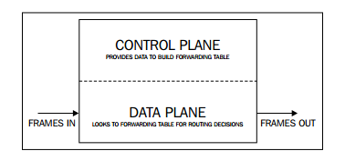

# OpenvSwitch


## 1. Khái niệm OpenvSwitch

### OpenvSwitch là gì?
  
* OpenvSwitch là phần mềm switch mã nguồn mở, dùng để hỗ trợ giao thức OpenFlow
* OpenvSwitch được sử dụng với các hypervisor để kết nối giữa các máy ảo trên một host vật lý và các máy ảo , giữa các host vật lý khác nhau qua mạng.
*  OpenvSwitch cũng được sử dụng trên một số các thiết bị chuyển mạch vật lý.
* OpenvSwitch là một trong những thành phần quan trọng hỗ trợ SDN.

 ### Control Plane và Data Plane

 * Khi sử dụng các con Ethernet Hub, thiết bị này chỉ làm công việc lặp đi lặp lại đó là mỗi khi nhận dữ liệu, nó lại forward tới tất cả các port mà nó kết nối.
 * Tuy nhiên điều này có thể gây nên nhiều hệ lụy xấu như broadcast storms, bandwidth bị giảm và looping (lụt). Kiểu truyền tải dữ liệu này được gọi là Data Plane/Forwarding Plane. 
 * Đó là lí do vì sao nó nhanh chóng bị thay thế bởi thiết bị layer 2 hay còn được biết tới với cái tên Network Switch. Thiết bị này về cơ bản đã "thông minh" hơn rất nhiều khi mà nó biết gửi dữ liệu tới đúng interface, và từ đây khái niệm control plane cũng bắt đầu xuất hiện.
 
 * Các thiết bị mạng đều có sự xuất hiện của control plane, nó cung cấp thông tin để xây lên bảng kết nối giúp các thiết bị mạng biết được chính xác nơi cần gửi dữ liệu.



### Tính năng trong OpenvSwitch

* Hỗ trợ VLAN tagging và chuẩn 802.1q trunking
* Hỗ trợ STP (Spanning tree protocol 802.1D)
* Hỗ trợ LACP
* Hỗ trợ sử dụng giao thức Sflow, netflow( Flow Export)
* Hỗ trợ các giao thức tunnels(GRE, VXLAN,IPSEC tunneling)
* Hỗ trợ kiểm soát QoS

## 2.Kiến trúc OpenvSwitch

### 2.1 Kiến trúc tổng quan


* OpenvSwitch thường dùng để kết nối các VMs/containers trong máy chủ vật lý. 

* Ba thành phần chính của OvS:

    **ovs-vswitchd**

    - là OpenvSwitch daemon chạy trên user space
    - ovs-vswitchd là daemon của Open vSwitch chạy trên userspace. Nó đọc cấu hình của Open vSwitch từ ovsdb-server thông qua kênh IPC (Inter Process Communication) và đẩy cấu hình xuống ovs bridge (là các instance của thư viện ofproto). Nó cũng đẩy trạng thái và thông tin thống kê từ các ovs bridges vào trong database.
    - ovs-switchd giao tiếp :
        - **Outside** - sử dụng OpenFlow
        - **ovs-dbserver** - sử dụng giao thức OVSDB protocol
        - **kernel** - thông qua netlink (tương tự như Unix socket domain)
        - **system** - thông qua abstract interface là netdev
    - tools: `ovs-appctl`, `ovs-dpctl`, `ovs-ofctl`, `sFlowTrend`

    - ovs-vswitchd triển khai mirroring, bonding và VLANs

    **ovsdb-server**

    - là database server của OpenvSwitch chạy trên user space.

    - Các cấu hình bền vững sẽ được lưu trữ trong ovsdb và vẫn lưu giữ khi sau khi khởi động lại hệ thống. Các cấu hình này bao gồm cấu hình về bridge, port, interface, địa chỉ của OpenFlow controller ()nếu sử dụng),...

    - tools:  `ovs-vsctl`, `ovsdb-client`

    **kernel module**(datapath)
    - Là module thuộc kernel space, thực hiện công việc chuyển tiếp gói tin
    
    - Module chính chịu trách nhiệm chuyển tiếp gói tin trong Open vswitch, triển khai trong kernelspace nhằm mục đích đạt hiệu năng cao. Nó caches lại OpenFlow flows và thực thi các action trên các gói tin nhận được nếu các gói tin nó match với một flow đã tồn tại. Nếu gói tin không khớp với bất kì flow nào thì gói tin sẽ được chuyển lên ovs-vswitchd. Nếu flow matching tại vswitchd thành công thì nó sẽ gửi gói tin lại cho kernel datapath kèm theo các action tương ứng để xử lý gói tin đồng thời thực hiện cache lại flow đó vào datapath để datapath xử lý những gói tin cùng loại đến tiếp sau. Hiệu năng cao đạt được ở đây là vì thực tế hầu hết các gói tin sẽ match flows thành công tại datapath và do đó sẽ được xử lý trực tiếp tại kernelspace.


    - tools: ovs-dpctl

### 3. Công cụ chính tương tác với OpenvSwitch


* `ovs-vsctl`: tiện ích chính sử dụng để quản lý các switch, nó tương tác với ovsdb-server để lưu cấu hình vào database của Open vSwitch. ovs-vsctl thực hiện truy vấn và áp dụng các thay đổi vào database tùy thuộc vào lệnh ta thực hiện. ovsdb-server sẽ nói chuyện với ovs-vswitchd qua giao thức OVSDB. Sau đó, nếu ovs-vsctl áp dụng bất kì thay đổi nào thì mặc định nó sẽ đợi ovs-vswitchd kết thúc việc tái cấu hình lại switch.

* `ovs-appctl`: cũng là công cụ để quản lý ovs-vswitchd bênh cạnh ovs-vsctl, nó gửi một số command nội bộ tới ovs-vswitchd để thay đổi một số cấu hình và in ra phản hồi từ ovs-vswitchd. ovs-vswitchd đồng thời cũng lưu lại các cấu hình này vào database bằng việc tương tác với ovsdb-server thông qua Unix domain socket.

* `ovs-dpctl`: đôi khi ta cần quản lý dapapath trong kernel trực tiếp mà thậm chí ovsdb-server không chạy, ta có thể sử dụng ovs-dpctl tương tác với ovs-vswitchd để quản lý datapath trong kernelspace trực tiếp mà không cần database.

* `ovsdb-client` và `ovsdb-tool`: khi cần nói chuyện với ovsdb-server để thực hiện một số thao tác với database, ta sử dụng ovsdb-client, hoặc nếu muốn xử lý database trực tiếp không thông qua ovsdb-server thì sử dụng ovsdb-tool.

* `ovs-ofctl` và `sFlowTrend`: Open vSwitch có thể được quản trị và giám sát bởi một remote controller. Điều này lý giải tại sao ta có thể định nghĩa mạng bằng phần mềm (hay Open vSwitch hỗ trợ SDN). Cụ thể hơn, sFlow là giao thức dể lấy mẫu gói tin và giám sát, trong khi OpenFlow là giao thức để quản lý flow table của switch, bridge hoặc device. Open vSwitch hỗ trợ cả OpenFlow và sFlow. Với ovs-ofctl, ta có thể sử dụng OpenFlow để kết nối với switch và thực hiện giám sát và quản trị từ xa. Trong khi đó sFlowTrend không phải là thành phần trong Open vSwitch packet mà là phần mềm độc lập hỗ trợ giám sát sử dụng sFlow.


### Các bước làm việc với OvS

* Kiểm tra lại OVS bằng lệnh:   
     
     `ovs-vsctl show` và `service openvswitch-switch status`

* Tạo bridge và gán interface cho bridge:
    
    `ovs-vsctl add-br <name_bridge>`
    
    `ovs-vsctl add-port <name_bridge> <name_port>`

* Kiểm tra các bridge đã tạo và port đã gắn: 

     `ovs-vsctl show`

* Chỉnh sửa file /etc/network/interfaces

  ``` auto <name_bridge>
    iface <name_bridge> inet static
    address 192.168.10.100
    netmask 255.255.255.0
    gateway 192.168.10.1
    network 192.168.10.0
    broadcast 192.168.10.255
    dns-nameservers 8.8.8.8 8.8.4.4 
    ```
* Tiến hành reset lại network

    `etc/init.d/networking restart`

* Các câu lệnh thường sử dụng:

   - ovs-vsctl : là câu lệnh để cài đặt và thay đổi một số cấu hình ovs. Nó cung cấp interface cho phép người dùng tương tác với Database để truy vấn và thay đổi dữ liệu.

    - ovs-vsctl show: Hiển thị cấu hình hiện tại của switch.
    - ovs-vsctl list-br: Hiển thị tên của tất cả các bridges.
    - vs-vsctl list-ports : Hiển thị tên của tất cả các port trên bridge.
    - ovs-vsctl list interface : Hiển thị tên của tất cả các interface trên bridge.
    - ovs-vsctl add-br : Tạo bridge mới trong database.
    - ovs-vsctl add-port : : Gán interface (card ảo hoặc card vật lý) vào Open vSwitch bridge.
    - ovs-ofctl và ovs-dpctl : Dùng để quản lí và kiểm soát các flow entries. OVS quản lý 2 loại flow:

        - OpenFlows : flow quản lí control plane
        - Datapath : là kernel flow.
    - ovs-ofctl giao tiếp với OpenFlow module, ovs-dpctl giao tiếp với Kernel module.
    - ovs-ofctl show : hiển thị thông tin ngắn gọn về switch bao gồm port number và port mapping.

    - ovs-ofctl dump-flows : Dữ liệu trong OpenFlow tables

    - ovs-dpctl show : Thông tin cơ bản về logical datapaths (các bridges) trên switch.

    - ovs-dpctl dump-flows : Hiển thị flow cached trong datapath.

    - ovs-appctl bridge/dumpflows: thông tin trong flow tables và offers kết nối trực tiếp cho VMs trên cùng hosts.

    - ovs-appctl fdb/show: Hiển thị các cặp mac/vlan.
---


### 2.2.2.	Cấu hình Open Vswitch trong file /etc/network/interfaces

-	Open vSwitch (OVS) thay thế cho Linux native Bridge, bonds và các interface vlan. OVS hỗ trợ hầu hết các đặc tính mà bạn mong muốn có như ở một switch vật lý, cung cấp một vài chức năng nâng cao như hỗ trợ RSTP, VXLAN, Open flow và hỗ trợ chia nhiều Vlan trên một bridge. Nếu bạn cần những tính năng này, hãy sử dụng OVS.

-	Khi cài đạt OVS trên ubuntu, khi khởi động Ubuntu OVS cũng được khởi động. Một số bridge, port – mà đã được định nghĩa trước và lưu lại cũng sẽ được khởi động (cái này có vẻ hơi không chuẩn, vì khi cấu hình OVS, tất cả mọi thay đổi đều được lưu vào OVS database) 

-	Phần này sẽ hướng dẫn cách cấu hình một số bridge, port, interface được lưu trong file `/etc/network/interfaces`. Mục đích khi cấu hình là khi máy khởi động – hoặc khi khởi động lại dịch vụ networking (ifdown – ifup/ service networking restart) thì những scrips trong linux sẽ tác động và dùng những tool của OVS để chỉnh sửa lại data của bridge, port, interfaces lại theo như cấu hình muốn lưu đó.

-	Lưu ý: mỗi bridge, port, interface là duy nhất trong hệ thống linux nên khi cấu hình trong file interfaces, tất cả mọi cấu hình trước đó trên một bridge (bridge mà cấu hình trong file interfaces) sẽ không được giữ lại và thay đổi theo cấu hình mà mình lưu trong file interfaces. (Hay hiểu theo cách đơn giản thì mọi dữ liệu, thông tin về các thành phần của OVS được lưu trong ovsdb, nên khi bạn cấu hình – bằng câu lệnh như `ovs-vsctl`, `ovs-apptcl`, ...  thì dữ liệu đó cũng thay đổi theo. Nhưng khi lưu lại cấu hình trong file interfaces thì khi khởi động lại dịch vụ network – hệ thống sẽ chạy dần những dòng cấu hình trong file => dẫn tới là chạy những scrip làm thay đổi dữ liệu trong ovsdb của bạn)

<a name = '2.2.2.1'></a>
#### 2.2.2.1.	Define a bridge

Tất cả các port và interface trên Openvswitch phải được gán vào một bridge. Định nghĩa một bridge (hay virtual switch) yêu cầu những cấu hình sau:

`ovs-vsctl add-br ovsbr1`

Câu lệnh trên tương tự như định nghĩa trong file `/etc/network/interfaces` như sau: 

```
# create an Openvswitch bridge
# on the commandline: ovs-vsctl add-br ovsbr1
auto ovsbr1
allow-ovs ovsbr1
iface ovsbr1 inet manual
	ovs_type OVSBridge
```

Trong đó: 

-	`auto`: cho phép bridge ovsbr1 tự động được khởi động bật lên cùng hệ thống. 

-	`allow-ovs` : thông báo cho hệ thống biết đó là một Open Vswitch bridge. Bridge tên ovsbr1

-	`iface`: định danh cho một interface trong file /etc/network.interfaces để khởi động cấu hình khi bắt đầu khởi động hệ thống.

-	`ovs_type`: Định nghĩa loại interface cho OVS. OVSBridge đại diện cho một OVS bridge.


<a name = '2.2.2.2'></a>
#### Define a L2 port (untagged)

- Phần này định nghĩa một port thuần layer 2 của switch (chỉ có nhiệm vụ forwarding gói tin, không có chức năng chia Vlan ... ) 

- Thêm một port layer 2 vào bridge vừa tạo ở trên (port này không là port local, nên hệ thống linux không "nhìn" thấy được)

	`ovs-vsctl add-port ovsbr1 l2port`

- Câu lệnh này tương được cấu hình trong file `/etc/network/interfaces` như sau: 

	```
	# create an untagged ovs port in vlan 444
	# (config not yet complete)
	allow-ovsbr1 l2port
	iface l2port inet manual
	  ovs_bridge ovsbr1
	  ovs_type OVSPort
	  ovs_options tag=444
	```
	Trong đó: 
	
	-	`allow-[name_of_the_bridge_to_attach_the_port]`: thông số xác định tên bridge mà port sẽ gán vào. Trong ví dụ này ovsbr1. Port tên l2port. 
	
	-	`iface`: Tương tự trên.
	
	-	`ovs-bridge`: thông số xác định bridge mà port sẽ attack vào. holds the name of the bridge to which the port should be attached to. In our example this is vmbr-int.
	
	-	`ovs_type`: Định nghĩa loại interface cho OVS. OVSPort xác định một port cảu OVS mà HĐH linux không "nhìn" thấy nó, nó chỉ bị quản lý bởi OVS.

	-	`ovs_options`: Định nghĩa thêm một số option cho port. ví dụ: gán port cho vlan 444.


#### Define a L2 port (tagged/trunking)

Định nghĩa port layer 2 mà có thể dùng làm port trunk (tagged port - port để gán tag các vlan)

```
# create an tagged ovs port
allow-ovsbr1 l2taggedport
iface l2taggedport inet manual
  ovs_bridge ovsbr1
  ovs_type OVSPort
  ovs_options trunks=2101,2102,2110,2120,2999,3000
```

Một port trunk không cần cấu hình gì thêm như port access bình thường, chỉ cần cấu hình phần options thêm các vlan mà nó cần gắn tag vào.

`ovs_options trunks=<vlan1_id>,<vlan2_id>,<vlan3_id>,<vlan4_id>,<vlan5_id>,...`


####Define a L3 interface

- Định nghĩa một interface layer 3 (gán được địa chỉ IP):

	```
	# create an untagged ovs port in vlan 444
	allow-ovsbr1 l3port
	iface l3port inet static
	  ovs_bridge ovsbr1
	  ovs_type OVSIntPort
	  ovs_options tag=444
	  address 192.168.1.254                   #hoặc cấu hình: address 192.168.1.254/24
	  netmask 255.255.255.0
	```

	Với: 

	-	`iface`: thiết lập mode static, bởi địa chỉ IP được cấu hình cho interface này.

	-	`ovs_type` :một L3 port phải được để kiểu Internal port - OVSIntPort (không hiểu tại sao :D ) – cái cổng này cần được cấp IP, nên mình nghĩ, cái IP stack nó nằm trong hệ thống linux, nên phải được nhìn thấy thì mới có thể cấp IP – đoán thế)

	-	`address - netmask`: địa chỉ và sunetmask cho port.

- Và cấu hình thêm port này vào đoạn cấu hình của bridge ovsbr1: 
	
	```
	auto ovsbr1
	allow-ovs ovsbr1
	iface ovsbr1 inet manual
	  ovs_type OVSBridge
	  ovs_ports l2port l3port
	```


#### Define a fake bridge

- Tương tự như định nghĩa một bridge thông thường. 

	`ovs-vsctl add-br ovsbr-fakebr ovsbr1 2102`

- Định nghĩa trong file `/etc/network/interfaces`: 

	```
	# a fake bridge without an ip address
	allow-ovsbr1 ovsbr-fakebr
	iface ovsbr-fakebr inet manual
	  ovs_bridge ovsbr1
	  ovs_type OVSBridge
	  ovs_options ovsbr1 2102
	```
	Với: 
	
	-	`ovs_type`: chọn là OVSBridge. 
	
	-	`ovs_options`: được thiết lập tới bridge parent (ở đây là ovsbr1) và id của vlan trên fake bridge đó. Định nghĩa một fake bridge đại diện cho vlan 2102. Các VM gắn vào bridge này sẽ auto join vào vlan 2102.

https://blog.csdn.net/ifzing/article/details/41308449


https://arthurchiao.github.io/blog/ovs-deep-dive-0-overview/

http://openvswitch.org/support/dist-docs/ovs-vsctl.8.html

http://www.opencloudblog.com/?p=240 